# High-Frequency Return Prediction with Machine Learning

## Project Overview

This project studies machine-learning methods for high-frequency return prediction using proprietary market data from an anonymized sample of A-share equities between September 11, 2025 and January 13, 2026.

Due to confidentiality obligations, the identities of the securities, underlying dataset, feature definitions, sample-level records, internal data interfaces, and source code are not disclosed. Only study dates, generic model descriptions and mathematical formulations, and anonymized aggregate model-performance results are reported.

The project evaluates linear baselines, a tree-based model, standalone neural networks, temporal-current hybrid models, and a final Transformer-anchored gated residual architecture.

Given an anonymized input representation

$$
x_{i,t}\in\mathbb{R}^{d_{\mathrm{in}}},
$$

the objective is to learn

$$
\hat{y}_{i,t}=f_{\theta}(x_{i,t}),
$$

where $\hat{y}_{i,t}$ represents a model-generated predictive signal.

Model comparison primarily uses daily Pearson Information Coefficient and Information Ratio. Architecture and hyperparameters are selected using a chronologically later validation period, while a separate held-out period is accessed only after the final model has been frozen.

---

## Abbreviation of Terms

<p align="center">
  <em><b>Table 1.</b> Abbreviations used throughout the report.</em>
</p>

| Abbreviation | Full Name |
| :---: | --- |
| LASSO | Least Absolute Shrinkage and Selection Operator |
| XGBoost | Extreme Gradient Boosting |
| MLP | Multilayer Perceptron |
| GRU | Gated Recurrent Unit |
| CNN | Convolutional Neural Network |
| RMSE | Root Mean Squared Error |
| IC | Information Coefficient |
| IR | Information Ratio |

---

## General Notation Table

<p align="center">
  <em><b>Table 2.</b> General notation used throughout the report.</em>
</p>

| Symbol | Meaning | Symbol | Meaning |
| :---: | --- | :---: | --- |
| $i$ | Sample index | $t$ | Time or date index, depending on context |
| $X$ | Input matrix or sequence representation | $x_{i,t}$ | Input vector for sample $i$ at time $t$ |
| $y_{i,t}$ | Realized future return | $\hat{y}_{i,t}$ | Model-predicted future return |
| $d_{\mathrm{in}}$ | Input feature dimension | $\theta$ | Learnable model parameters |
| $IC$ | Pearson Information Coefficient | $IR$ | Information Ratio |

---

## Data Split

The data are divided chronologically before model training. Because high-frequency market data has a strong time order, future periods are not used to tune models trained on earlier periods. All data-dependent preprocessing details are omitted from this public report.

<p align="center">
  <em><b>Table 3.</b> Chronological train, validation, and test split.</em>
</p>

| Split | Days | Main Use |
| :---: | :---: | --- |
| Train | 45 days | Fit model parameters |
| Validation | 15 days | Tune hyperparameters and compare model configurations |
| Test | 20 days | Reserved for final evaluation |

<u>Unless otherwise stated, the evaluation of model configurations and the tuning figures are based on validation performance.</u> This prevents repeated adaptation to the test set during tuning and thereby avoids test-set leakage.

## Computation of Evaluation Metrics

For each evaluated day $d$, IC is computed as the Pearson correlation between true future returns and model predictions:

$$
IC_d = \operatorname{Corr}(y_d, \hat{y}_d)
$$

The average IC measures overall predictive strength, where $D$ is the number of evaluated dates:

$$
IC_{\mathrm{mean}} = \frac{1}{D}\sum_{d=1}^{D} IC_d
$$

*In this report, the term "IC" refers to $IC_{\mathrm{mean}}$ unless otherwise stated.*

IR measures how stable the daily IC values are:

$$
IR = \frac{IC_{\mathrm{mean}}}{\operatorname{std}(IC_d)}
$$

Throughout this report, daily IC standard deviation is computed as the sample standard deviation across the evaluated dates.

A model with high $IC_{\mathrm{mean}}$ but low $IR$ may have strong average performance but unstable daily performance. Therefore, I use both IC and IR when comparing configurations.

>
>In general, the best model should give both high $IC_{\mathrm{mean}}$ and $IR$. The models with high $IC_{\mathrm{mean}}$ but low $IR$ need to be considered cautiously.

### Model Selection Rule

As explained previously, selecting only the model with the highest IC may choose a configuration whose improvement is very small but whose daily performance is much less stable. Conversely, selecting only by IR may choose a stable model with a very weak predictive strength.

The project therefore applies a two-stage selection rule that considers both IC and IR. It first retains configurations whose IC is within 0.003 of the maximum observed IC:

$$
\mathcal C
=
\left\{
m:
\operatorname{IC}_m
\ge
\operatorname{IC}_{\max}-0.003
\right\}
$$

where $m$ indexes the candidate models.

The threshold considers models with very similar IC values as candidates and prevents configurations with relatively low IC from being selected only because of a high IR. Among the selected candidates, the model with the highest IR is chosen as the optimal configuration:

$$
m^*
=
\arg\max_{m\in\mathcal C}
\operatorname{IR}_m
$$

>
>IC is used as the primary performance filter, while IR is used as the tie-breaker among models with near optimal IC.

---

# Linear Models

Compared with tree-based and neural models, linear models are simple, fast, and easy to interpret. They provide an initial assessment of whether the internal input representation contains a measurable linear signal and whether regularization can improve generalization before more complex nonlinear models are introduced.

## Ridge Regression (L2 Regularization)

Ridge regression is first used to establish a linear baseline. It applies L2 regularization to reduce overfitting while retaining the available internal inputs.

A simplified Ridge objective is:

$$
\arg\min_{\beta}
\left(
\|y - X\beta\|_2^2
+
\alpha \|\beta\|_2^2
\right)
$$

Here, the key hyperparameter is $\alpha$, which controls the strength of regularization. A larger $\alpha$ forces the coefficients to shrink more strongly toward zero, reducing model variance. However, an overly large $\alpha$ may also increase bias.

Across the tested `alpha` values, Ridge regression's performance was relatively insensitive to `alpha`, with approximately IC = 0.1928, IR = 11.25 for all experiments. This suggests that simply changing the L2 penalty is unlikely to create a large improvement. This makes Ridge useful as a baseline, but not strong enough as the main model for this task.

## LASSO Regression (L1 Regularization)

LASSO regression is introduced as another linear baseline and as an internal feature-selection method.

A simplified LASSO objective is:

$$
\arg\min_{\beta}
\left(
\|y-X\beta\|_2^2
+
\alpha\|\beta\|_1
\right).
$$

Compared with Ridge, LASSO can shrink some coefficients exactly to zero. It is therefore used internally to construct a regularized input representation for the nonlinear models.

All data-dependent feature-selection details are omitted from this public report. Only the role of LASSO in the modeling pipeline and the resulting aggregate model-performance comparisons are discussed.

LASSO is not treated as the strongest final predictor. Its main purpose is to provide a consistent regularized preprocessing step for the later nonlinear and temporal models.

---

# Nonlinear Models

## Tree Model

### Extreme Gradient Boosting (XGBoost)

XGBoost is a classical nonlinear tree-based model. It builds an ensemble of regression trees sequentially, where each new tree corrects part of the prediction error from the previous trees. This structure allows XGBoost to capture nonlinear feature effects and feature interactions in high-frequency market data.

The XGBoost experiments focus on two questions:

1. Does nonlinear tree-based modeling improve on the linear baselines?
2. Which regularization settings provide a useful balance between IC and IR?

An XGBoost prediction for sample $i$ is produced by:

$$
\hat{y}_i = \sum_{m=1}^{M} f_m(x_i)
$$

Here, each $f_m$ is a regression tree, and $M$ is the number of trees.

#### Preprocessing and Computational Budget

The XGBoost experiments use the same fixed internal preprocessing protocol as the subsequent model comparisons. Data-dependent preprocessing details are omitted from this public report.

The development experiments showed diminishing returns as the computational budget increased. A fixed computational protocol was therefore adopted so that differences in IC and IR primarily reflected model behavior rather than changes in experimental budget.

#### Parameter Tuning Process

After fixing the internal preprocessing protocol, I tune the main XGBoost regularization parameters.

These parameters are:

- `n_estimators`: the maximum number of boosting trees. More trees can reduce bias, but too many trees may overfit and increase training time.
- `reg_lambda`: the strength of L2 regularization on leaf weights. A larger `reg_lambda` makes the tree ensemble more conservative.
- `reg_alpha`: the strength of L1 regularization on leaf weights. A larger `reg_alpha` makes leaf weights smaller.
- `gamma`: the minimum loss reduction required for a split. A larger $\gamma$ makes tree splitting more conservative.

Note that `n_estimators` is adjusted by setting the hyperparameter `n_estimators_cap`:
- `n_estimators_cap`: the maximum number of boosting rounds allowed during training. When early stopping is used, the effective model size is determined by the best validation iteration rather than by the cap itself.


>  Effects of Parameters on XGBoost Performance
> In summary, `n_estimators` controls how long the boosting process continues, while `reg_lambda`, `reg_alpha`, and `gamma` control how conservative the trees are.

<p align="center">
  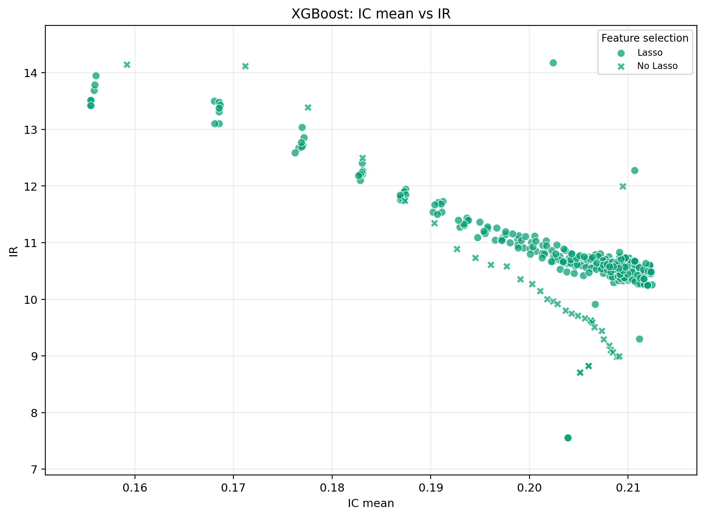
</p>

<p align="center">
  <em><b>Figure 1.</b> XGBoost IC mean versus IR across evaluated configurations.</em>
</p>

Figure 1 shows that XGBoost improves IC over the linear baseline. However, configurations with higher IC do not always have higher IR, indicating a trade-off between predictive strength and date-level stability.

#### XGBoost Hyperparameter Selection

After fixing the internal preprocessing protocol, the main XGBoost regularization parameters were compared using validation IC and IR. Only model-level performance and non-data-specific hyperparameters are reported.

<p align="center">
  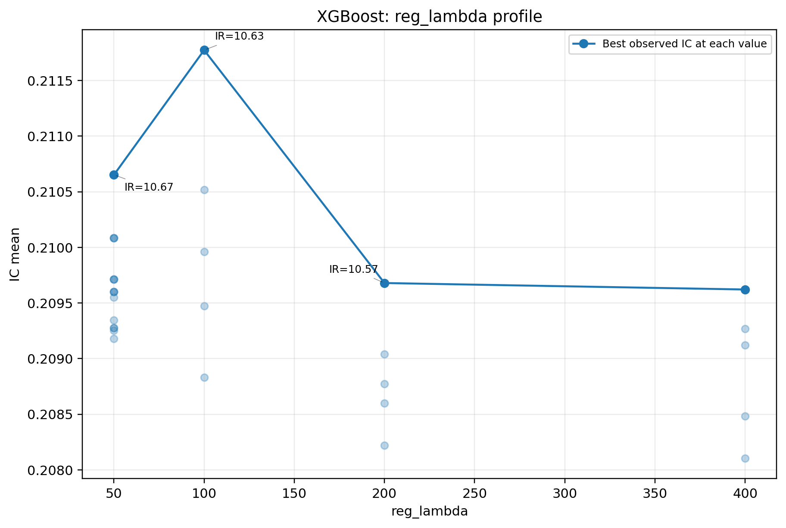
  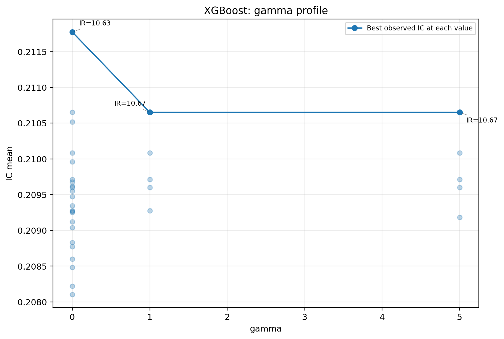
</p>

<p align="center">
  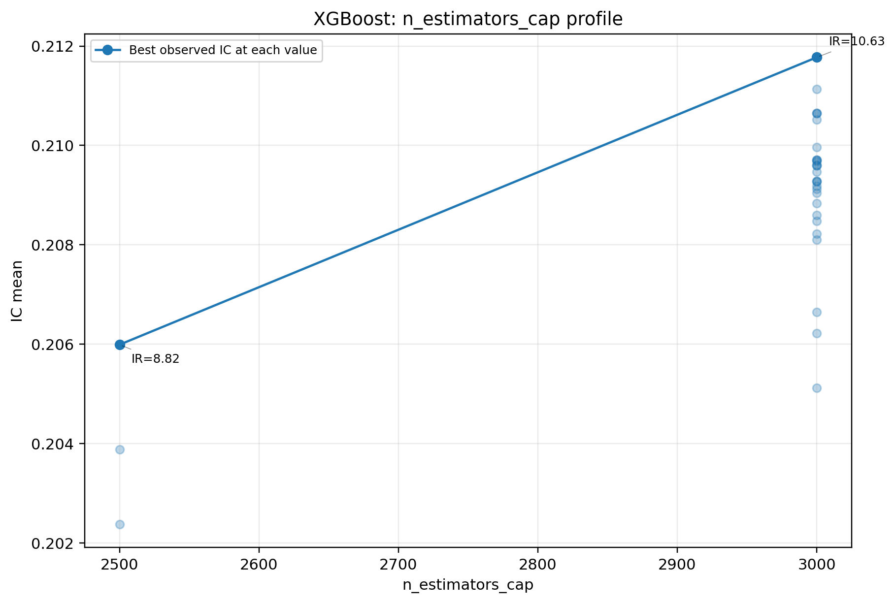
  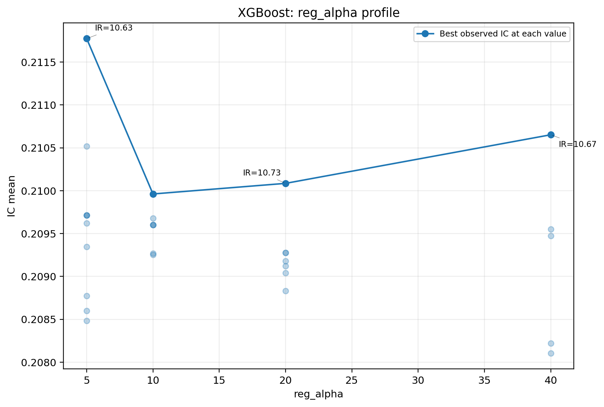
</p>
<p align="center">
  <em><b>Figure 2.</b> XGBoost performance under selected regularization and boosting parameters.</em>
</p>

The parameter profiles suggest that moderate regularization performs best. Increasing `reg_lambda` from 50 to 100 obtains the highest observed IC, while stronger values of 200 and 400 reduce predictive performance.


The `n_estimators_cap` profile also supports using a maximum of 3,000 boosting rounds. Among all XGBoost experiments, the best validation IC occurs at iteration 2,989.

The following heatmaps further show that `reg_lambda = 100`, `reg_alpha = 5`, and `gamma = 0` produce the best observed IC.

<p align="center">
  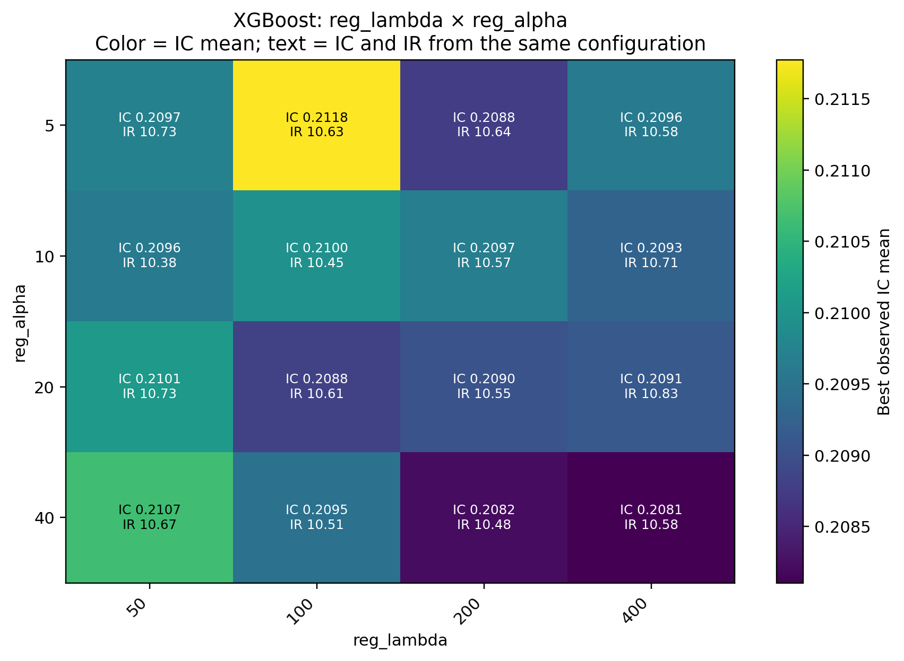
  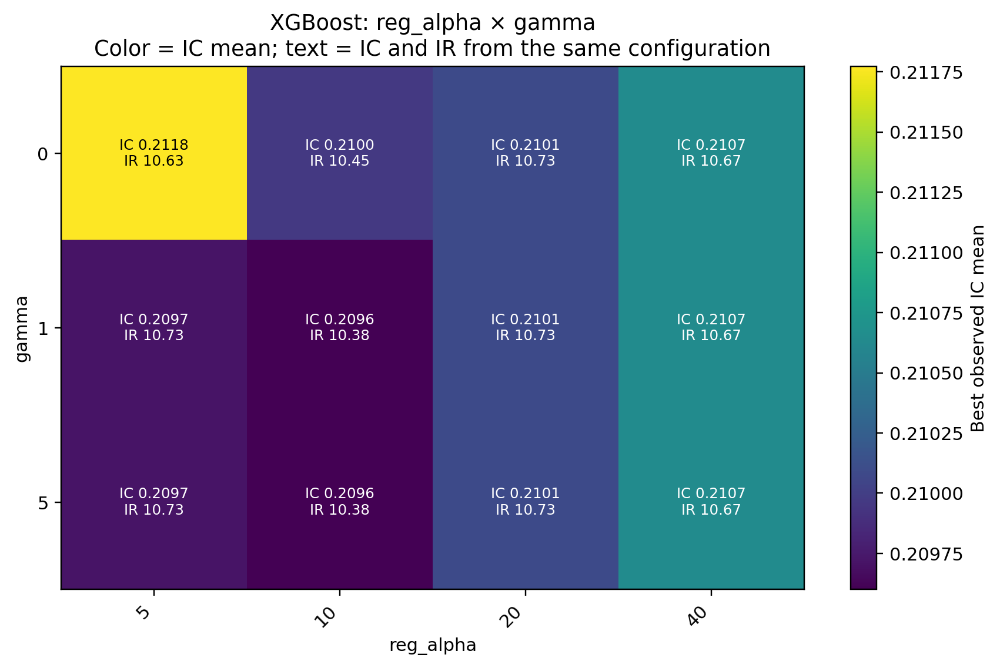
</p>

<p align="center">
  <em><b>Figure 3.</b> XGBoost peak IC under selected regularization-parameter combinations.</em>
</p>


The regularization heatmaps indicate that there exists a relatively broad region of similar validation performance rather than a single sharply defined optimum.

Note that the small differences among nearby configurations suggest that XGBoost performance is not highly sensitive to the exact regularization values within this range. <u>Hence, the model's improvement on IC is more likely associated with its ability to capture nonlinear relationships and feature interactions. Meanwhile, adjusting regularization hyperparameters mainly controls model complexity and stability.</u>

#### Selected XGBoost Configuration

<p align="center">
  <em><b>Table 4.</b> Selected XGBoost configuration.</em>
</p>

| Parameter | Value | Parameter | Value |
| :--- | :---: | :--- | :---: |
| `max_depth` | 3 | `learning_rate` | 0.02 |
| `n_estimators_cap` | 3000 | Best iteration | 2989 |
| `reg_lambda` | 100 | `reg_alpha` | 5 |
| `gamma` | 0 | `min_child_weight` | 300 |
| `subsample` | 0.7 | `colsample_bytree` | 0.8 |
| `max_bin` | 64 |  |  |

The selected configuration achieves a validation IC of **0.2118** and an IR of **10.63**. It is retained as the final XGBoost model for subsequent model comparison and ensemble construction.

---
## Neural Network Models

### Epoch Selection and Early Stopping

The following epoch curves show that most neural models already reach a strong validation performance by epoch 2. Further training rarely produces consistent improvements and often leads to unstable or declining validation results.

<p align="center">
  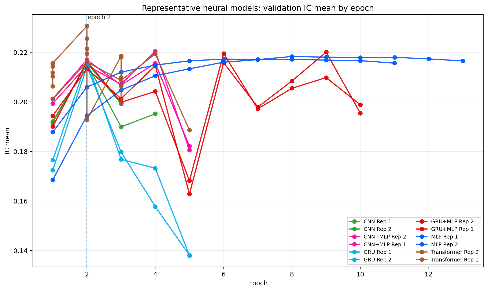
</p>

<p align="center">
  <em><b>Figure 4.</b> Representative validation IC curves across neural-network families.</em>
</p>

<p align="center">
  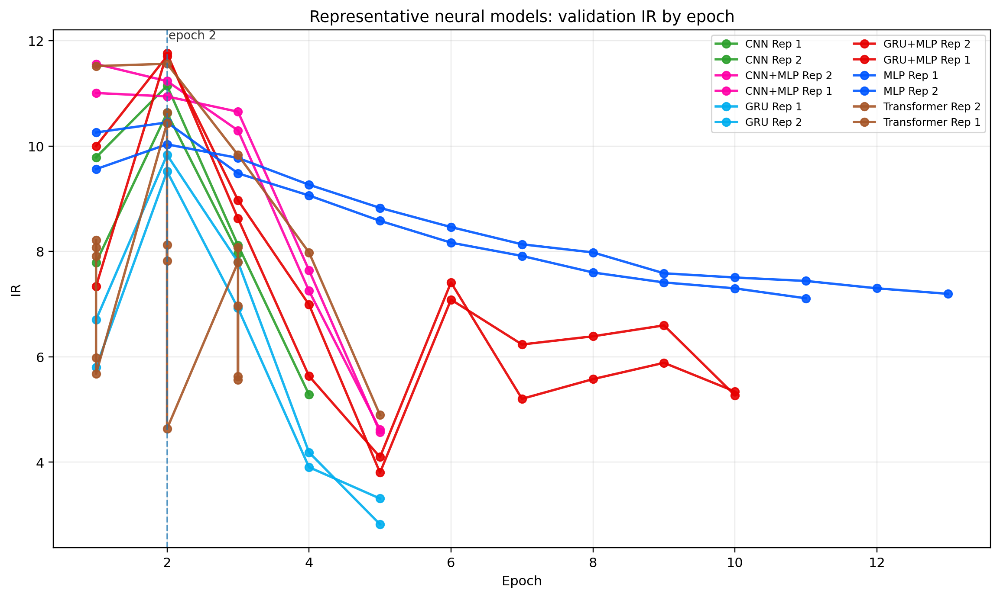
</p>

<p align="center">
  <em><b>Figure 5.</b> Representative validation IR curves across neural-network families.</em>
</p>

Epoch 2 is therefore used as the default setting for training neural network models. This avoids unnecessary computational cost while retaining a relatively high IC/IR performance. Hence, longer runs (2+) are used only when testing whether a particular configuration can produce a consistent improvement when increasing training epoch.

Note that MLP shows a different training pattern from the temporal neural models: its validation IC improves more gradually and then approaches a plateau, rather than declining sharply after epoch 2. However, the continued decrease in IR indicates that the small later IC gains do not imply a more stable validation performance, so epoch 2 remains a reasonable default setting.

### Multilayer Perceptron (MLP)

A Multilayer Perceptron (MLP) is a neural network that learns nonlinear combinations of input features through fully connected hidden layers. A simplified MLP can be written as:

$$
\hat{y}_{i,t}
=
W_2\sigma(W_1x_{i,t}+b_1)+b_2,
$$

where $W_1$ and $W_2$ are trainable weight matrices, $b_1$ and $b_2$ are bias terms, and $\sigma$ is a nonlinear activation function. The hidden layer transforms the original features into a nonlinear representation, which is then mapped to the predicted future return.

A standard MLP processes each observation independently. It can use information already encoded in the internal input representation, but it has no mechanism for explicitly modeling temporal order. Therefore, MLP is used as a nonlinear baseline and as a prediction component for later hybrid models.

<p align="center">
  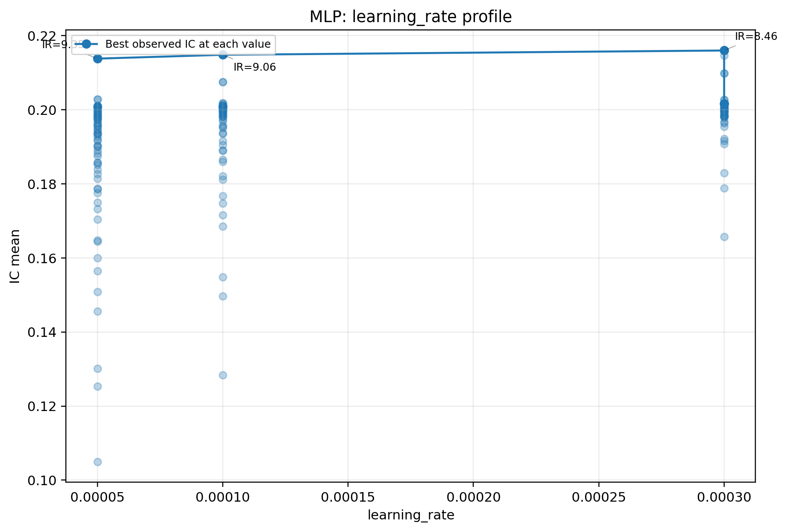
  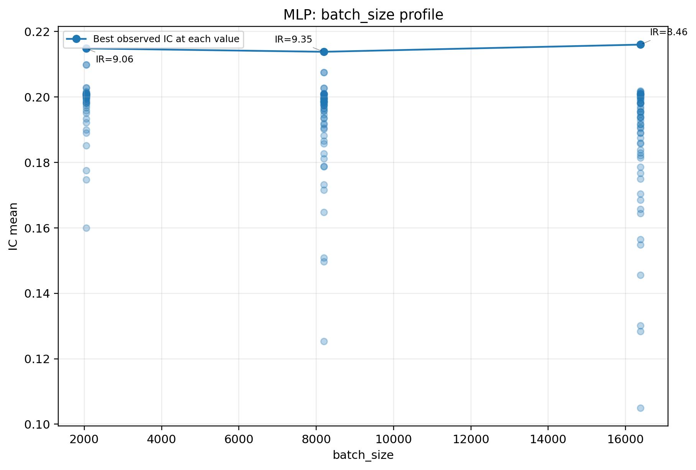
</p>

<p align="center">
  <em><b>Figure 6.</b> MLP performance under selected learning rates and batch sizes.</em>
</p>

Note that the highest IC values are consistently produced by the two-layer structure with hidden size $(64,32)$. Within the tested range, increasing the learning rate achieves a small improvement in the best observed IC. The highest observed IC is obtained with a learning rate of `3e-4` and a batch size of 16,384.

The profiles also indicate a trade-off between predictive strength and stability. The selected MLP baseline reaches a validation IC of **0.21598**, exceeding the selected XGBoost model in peak IC, but its IR is much lower than the XGBoost baseline (**8.46**). Smaller learning rates and batch sizes can produce slightly higher IR with lower peak IC.

#### Selected MLP Configuration

<p align="center">
  <em><b>Table 5.</b> Selected MLP configuration.</em>
</p>

| Parameter | Value | Parameter | Value |
| :--- | :---: | :--- | :---: |
| Hidden layers | $(64,32)$ | Activation | ReLU ($f(x) = \max(0,x)$)|
| Learning rate | `3e-4` | MLP L2 `alpha` | `1e-3` |
| Batch size | 16,384 | Selected epoch | 6 |
| Epochs trained | 13 |  |  |
| Validation IC | **0.21598** | Validation IR | **8.46** |

>
> ReLU is used in the hidden layers because it is computationally efficient and less prone to vanishing gradients than sigmoid or tanh. The final regression output layer is linear.

MLP indicates that nonlinear transformations of the input features contain useful predictive information, which agrees with the pattern observed in the XGBoost model. Since it does not explicitly model temporal order and its selected baseline with highest IC has a low IR, it is not treated as the main model. Note that the IR of MLP varied greatly from experiment to experiment, as shown in the following figure, so it tends to be unstable. As a result, MLP is primarily treated as a benchmark and as the nonlinear prediction head in hybrid models, such as GRU+MLP and CNN+MLP.

<p align="center">
  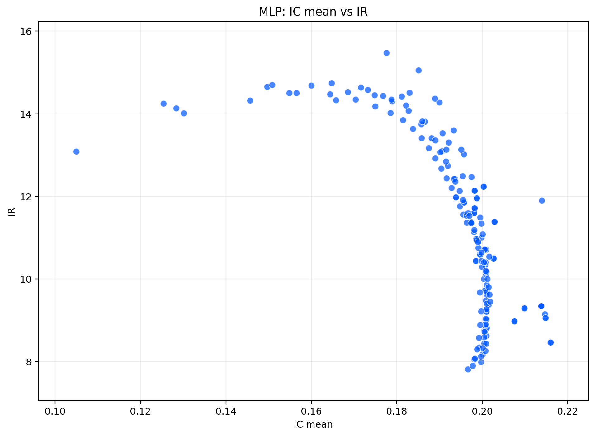
</p>

<p align="center">
  <em><b>Figure 7.</b> MLP IC mean versus IR across evaluated configurations.</em>
</p>

---


### Gated Recurrent Unit (GRU)

A GRU is a recurrent neural network designed to process sequential data. It uses reset and update gates to control how information flows through time. The reset gate determines how much past information should be ignored, while the update gate balances newly observed information against the existing hidden state. Hence, GRU preserves useful temporal patterns and reduces the loss of information over longer sequences.

The GRU model first projects each input into a learned representation and then processes the sequence recurrently in the following order:


$$\text{Input}\rightarrow\text{Projection}\rightarrow\text{GRU sequence modeling}\rightarrow\text{Prediction head}\rightarrow\hat{y}$$

A simplified GRU formulation is:

$$
p_t=\phi(W_p x_t+b_p),
\qquad
h_t=\operatorname{GRU}(p_t,h_{t-1}),
\qquad
\hat{y}=f_{\mathrm{head}}(h_T)
$$


Here, $p_t$ is the projected representation of the input at time $t$, and $h_t$ is the hidden state that combines current information with information retained from earlier time steps. After the full sequence is processed, the final hidden state $h_T$ is passed through a prediction head $f_{\mathrm{head}}(\cdot)$ to produce the future return prediction $\hat{y}$.

Unlike MLP, which processes each observation independently, GRU explicitly uses the temporal order of observations. In this project, each input sequence contains eight time steps. I apply GRU to evaluate whether temporal modeling strengthens the Pearson correlation between predicted and realized future returns.

<p align="center">
  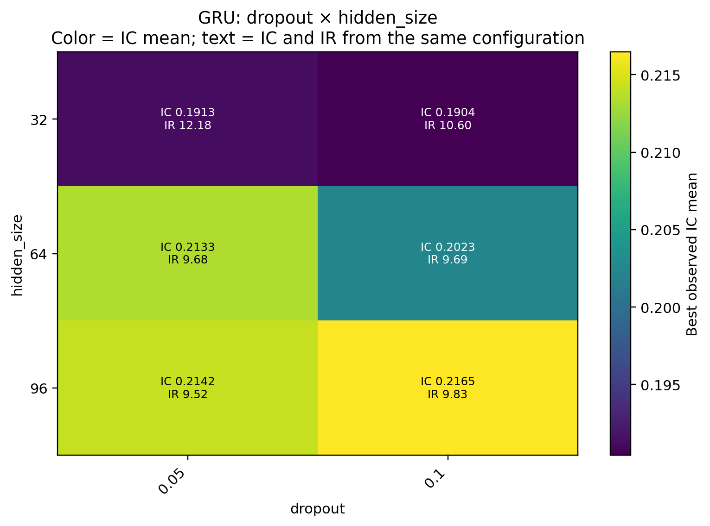
  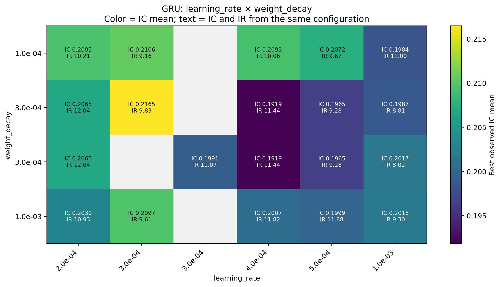
</p>

<p align="center">
  <em><b>Figure 8.</b> GRU peak IC under selected hidden-size, dropout, learning-rate, and weight-decay settings.</em>
</p>

Increasing `hidden_size` from 32 to 64 substantially raises the best observed IC, while the additional gain from 64 to 96 is smaller. This indicates that a larger hidden size improves the GRU’s ability to analyze temporal information, although the marginal gain diminishes at larger sizes. The learning-rate × weight-decay heatmap further shows that the strongest observed result occurs at `learning_rate = 3e-4` and `weight_decay = 3e-4`.

<u>Across the tested configurations, the highest validation IC is obtained with `hidden_size = 96`, `projection_size = 128`, `learning_rate = 3e-4`,  `weight_decay = 3e-4`, and `dropout = 0.1`. </u>


#### Selected GRU Configuration

<p align="center">
  <em><b>Table 6.</b> Selected GRU configuration.</em>
</p>

| Parameter | Value | Parameter | Value |
| :--- | :---: | :--- | :---: |
| Sequence length | 8 | Selected epoch | 2 |
| Input projection size | 128 | GRU hidden size | 96 |
| GRU layers | 1 | Prediction-head size | 48 |
| Dropout | 0.1 | Batch size | 1,024 |
| Learning rate | $3\times10^{-4}$ | Weight decay | $3\times10^{-4}$ |
| Epochs trained | 5 | |  |
| Validation IC | **0.21647** | Validation IR | **9.83** |

The selected GRU baseline slightly improves Pearson IC over the selected MLP and XGBoost baselines. This suggests that explicitly modeling short-term temporal data can strengthen the Pearson correlation between model predictions and realized future returns. Because GRU directly maps the temporal hidden state to a relatively simple prediction head, I use it mainly as the temporal baseline for subsequent nonlinear models.

---

### Convolutional Neural Network (CNN)

Since the input is a one-dimensional time sequence, a 1-D CNN is used as another approach to capturing short-term temporal patterns. Unlike a GRU, a CNN examines several neighboring time steps at the same time using small shared filters. These filters can detect local patterns such as short-term trends, sudden changes, or repeated movements.

To prevent future information from being used when predicting the current target, the model uses **causal convolution**. Hence, the representation at time $t$ is constructed only from observations at $t$ and earlier:

$$
z_t
=
\phi\left(
\sum_{j=0}^{k-1} W_j x_{t-j} + b
\right)
$$

where $k$ is the convolution window size, $W_j$ represents the filter weights, and $\phi$ is the activation function.

The overall processing pipeline is:

$$
\text{Input sequence}
\rightarrow
\text{Causal convolution layers}
\rightarrow
\text{Temporal pooling}
\rightarrow
\text{Prediction head}
\rightarrow
\hat{y}
$$

The convolutional layers extract local temporal patterns, while the selected pooling operation combines recent and sequence-level information before the regression head produces the prediction.

Therefore, CNN learns temporal patterns by repeatedly applying local filters across the sequence, making it a simple and efficient method for modeling short-term dependencies.

<p align="center">
  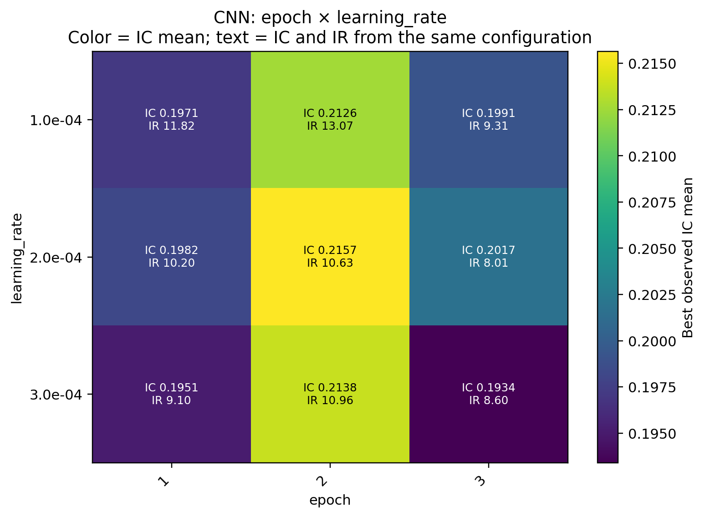
  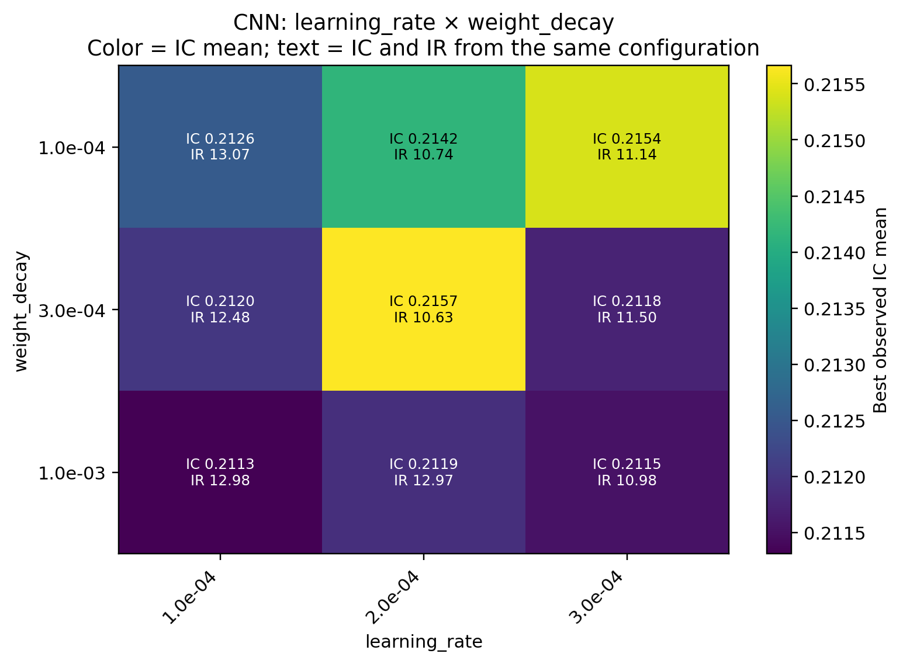
</p>

<p align="center">
  <em><b>Figure 9.</b> CNN peak IC under selected epoch, learning-rate, and weight-decay settings.</em>
</p>

Across all tested learning rates, the strongest validation IC occurs at epoch 2, while performance is lower at both epochs 1 and 3. Note that the decline after epoch 2 is consistent with rapid saturation and early overfitting. This consistent pattern suggests that the CNN learns useful local representations quickly but also reaches its peak early.

Additionally, CNN performance varies more moderately across the selected learning-rate and weight-decay combinations. The highest observed IC is obtained with `learning_rate = 2e-4` and `weight_decay = 3e-4`. Increasing `weight_decay` to 1e-3 slightly reduces the model's performance ceiling.


#### Selected CNN Configuration
<p align="center">
  <em><b>Table 7.</b> Selected CNN configuration.</em>
</p>

| Parameter | Value | Parameter | Value |
| :--- | :---: | :--- | :---: |
| Sequence length | 8 | Weight decay | $3\times10^{-4}$ |
| CNN architecture | Causal Residual CNN | Convolution channels | 64, 64 |
| Kernel sizes | 3, 3 | Pooling | Last Mean |
| Prediction-head size | 64 | Dropout | 0.1 |
| Batch size | 2,048 | Learning rate | $2\times10^{-4}$ |
| Epochs trained | 3 | Selected epoch | 2 |
| Validation IC | **0.21566** | Validation IR | **10.63** | 

The core convolutional architecture was intentionally kept fixed throughout the experiments. Hyperparameter tuning mainly focused on optimization settings (learning rate, batch size, and training epochs), with only a limited pooling comparison rather than a broader network-structure search. This allows the results to better reflect the effectiveness of a simple causal convolutional architecture for short-term temporal modeling.

Furthermore, under otherwise identical settings, combining the final temporal representation with mean pooling increases validation IC from approximately `0.21273` to `0.21566`. This information suggests that the CNN benefits from keeping both the most recent local data and information aggregated across the full 8-step sequence.

---

### Transformer

The Transformer is tested for modeling short-term temporal information. It uses self-attention to allow every temporal position to interact directly with the other positions.

After the internal preprocessing stage, each observation is represented as an 8-step sequence:

$$
X\in\mathbb{R}^{8\times d_{\mathrm{in}}}
$$

Each input vector is first projected into a lower-dimensional hidden representation:

$$
z_t
=
x_tW_{\mathrm{in}}+b_{\mathrm{in}}+p_t
$$

where $p_t$ is a learnable positional embedding. Note that positional information is required because self-attention alone does not distinguish earlier observations from more recent ones.

#### Transformer Model Design

For each encoder layer, self-attention constructs query, key, and value matrices:

$$
Q=ZW^Q,\qquad
K=ZW^K,\qquad
V=ZW^V,
$$

and calculates

$$
\operatorname{Attention}(Q,K,V)
=
\operatorname{softmax}
\left(
\frac{QK^{\mathsf T}}{\sqrt{d_k}}
\right)V
$$

This allows each temporal position to combine information from the 8-step sequence.

Then, the attention output is combined with the original representation through a residual connection and layer normalization:

$$
Z_{\mathrm{attention}}
=
\operatorname{LayerNorm}
\left(
Z+\operatorname{MultiHeadAttention}(Z)
\right),
\qquad Z_{\mathrm{attention}}\in\mathbb{R}^{8\times d_{\mathrm{model}}}
$$


The residual connection preserves the original representation while allowing the attention module to add useful temporal information. Layer normalization helps keep the hidden representations numerically stable during training.

Each temporal position is then passed independently through the same feed-forward network (FFN), which applies a shared nonlinear transformation to its features:

$$
\operatorname{FFN}(z_t)
=
W_2\sigma(W_1z_t+b_1)+b_2,
\qquad z_t\in\mathbb{R}^{d_{\mathrm{model}}}
$$

where $\sigma$ is a nonlinear activation function and $z_t$ is the $t$-th row of $Z_{\mathrm{attention}}$, representing the feature vector at temporal position $t$ after self-attention. The feed-forward network first expands the hidden representation and then projects it back to $d_{\mathrm{model}}$ dimensions:

$$
d_{\mathrm{model}}
\longrightarrow
d_{\text{feedforward}}
\longrightarrow
d_{\mathrm{model}}
$$

The feed-forward output is again combined with its input through a residual connection and layer normalization:

$$
Z_{\mathrm{output}}
=

\operatorname{LayerNorm}
\left(
Z_{\mathrm{attention}}
+
\operatorname{FFN}(Z_{\mathrm{attention}})
\right).
$$

>
>Note that self-attention and the feed-forward network have different purposes:
> - self-attention exchanges information across the eight temporal positions;
>- the feed-forward network performs a nonlinear transformation within each position.
>A complete Transformer encoder layer can be summarized as:
>```mermaid
>flowchart LR
>    A["Encoder Input<br/>(8 × d_model)"]
>    B["Multi-Head<br/>Self-Attention"]
>    C["Residual Connection<br/>and LayerNorm"]
>    D["Position-Wise<br/>Feed-Forward Network"]
>   E["Residual Connection<br/>and LayerNorm"]
>   F["Encoder Output<br/>(8 × d_model)"]
>    A --> B --> C --> D --> E --> F
>```

Multiple encoder layers can be stacked:

$$
Z^{(l)}
=
\operatorname{EncoderLayer}_l
\left(
Z^{(l-1)}
\right),
\qquad
l=1,\ldots,L.
$$

where $L$ is the number of Transformer encoder layers.

The sequence shape remains

$$
8\times d_{\mathrm{model}}
$$

throughout the encoder. Increasing the number of encoder layers therefore increases model depth without changing the representation size.

After the final encoder layer, the model still uses 8 hidden vectors to represent each temporal position:

$$
Z^{(L)}
\in
\mathbb{R}^{8\times d_{\mathrm{model}}}.
$$

To choose a single representation of an observation, Transformer applies pooling to combine these 8 vectors:

$$
Z^{(L)}
\longrightarrow
h_{\text{pool}}
\in
\mathbb{R}^{d_{\mathrm{model}}}.
$$

The pooled representation is then passed through a fully connected regression head:

$$
h_{\text{pool}}
\longrightarrow
\text{head hidden layer}
\longrightarrow
\hat{y}.
$$

>
>The complete prediction process is:
>```mermaid
>flowchart LR
>    A["Input Sequence<br/>(8 × d_in)"]
>    B["Input Projection<br/>d_in → d_model"]
>    C["Positional Encoding"]
>    D["Transformer Encoder Layer"]
>    E["Pooling"]
>    F["Regression Head"]
>    G["Continuous Prediction<br/>ŷ"]
>
>    A --> B --> C --> D --> E --> F --> G
>```
>In dimensional terms, the pipeline is:
>$$
\underbrace{(8,d_{\mathrm{in}})}_{\text{input sequence}}
\longrightarrow
\underbrace{(8,d_{\mathrm{model}})}_{\text{projected sequence}}
\longrightarrow
\underbrace{(8,d_{\mathrm{model}})}_{\text{encoder output}}
\longrightarrow
\underbrace{d_{\mathrm{model}}}_{\text{pooled representation}}
\longrightarrow
\underbrace{1}_{\text{prediction}}
>$$

#### Transformer Parameters

**The main Transformer parameters are:**

<p align="center">
  <em><b>Table 8.</b> Main Transformer parameter definitions.</em>
</p>

| Parameter | Meaning |
| :--- | :--- |
| $d_{\mathrm{model}}$ | Hidden dimension used to represent each temporal position |
| `nhead` | Number of parallel self-attention heads |
| `num_layers` | Number of stacked Transformer encoder layers |
| `dim_feedforward` | Hidden width of the feed-forward network inside each encoder layer |
| `pooling` | Method used to combine the eight encoder outputs into one vector |
| `head_hidden_size` | Hidden width of the final fully connected regression head |

For example, let $d_{\mathrm{in}}$ denote the undisclosed dimension of the internally preprocessed input. A selected Transformer may use

$$
d_{\mathrm{in}}
\longrightarrow
d_{\mathrm{model}}=80
$$

With four attention heads, each head operates on

$$
d_k=\frac{80}{4}=20
$$

dimensions. Each encoder layer contains a feed-forward transformation

$$
80\longrightarrow160\longrightarrow80,
$$

followed by a regression head

$$
h_{\mathrm{pool}}\longrightarrow64\longrightarrow\hat{y}
$$

The regression output layer is linear. No sigmoid or softmax is applied to the final output.

---

#### Sequence Pooling

The Transformer encoder returns one representation for each temporal position:

$$
H=[\vec{h_1},\vec{h_2},\ldots,\vec{h_T}].
$$

Pooling is applied to convert these eight vectors into one sequence-level representation. Here are some pooling methods used during Transformer experiments.

##### 1. Last Pooling

$$
h_{\text{pool}}=h_T
$$

The final position is used as the sequence representation. Note that although only $h_T$ is selected, it has already incorporated information from the other positions through self-attention.

##### 2. Mean Pooling

$$
h_{\text{pool}}
=
\frac{1}{T}\sum_{t=1}^{T}h_t.
$$

Mean pooling treats all temporal positions equally, but it may dilute information concentrated near the most recent observation.

##### 3. Last-Mean Pooling

$$
h_{\text{pool}}
=
\left[
h_T;
\frac{1}{T}\sum_{t=1}^{T}h_t
\right].
$$

This concatenates the latest contextualized state with the average sequence state. For $d_{\mathrm{model}}=80$, the resulting representation has 160 dimensions.

##### 4. Attention Pooling

$$
w_t
=
\frac{\exp(f_{\mathrm{pool}}(h_t))}
{\sum_{j=1}^{T}\exp(f_{\mathrm{pool}}(h_j))},
\qquad
h_{\text{pool}}
=
\sum_{t=1}^{T}w_t h_t.
$$

Each $f_{\mathrm{pool}}(h_t)$ here is a neural network and $w_t$ is the resulting softmax weight. Attention pooling learns an additional importance weight for each temporal position. It introduces another learned attention mechanism after the Transformer encoder has already performed self-attention.

---

#### Training Objective

Based on the preceding neural-model experiments, the model is trained using MSE with an auxiliary Pearson-correlation objective:

$$
\mathcal L
=
\operatorname{MSE}(y,\hat{y})
-
\lambda_{\mathrm{IC}}
\operatorname{Corr}(y,\hat{y}),
$$

where the selected IC-loss weight is

$$
\lambda_{\mathrm{IC}}=0.15.
$$

MSE provides a regression objective, while the auxiliary correlation term makes training more sensitive to the IC-based evaluation metric. Correlation does not replace MSE because using only IC as the loss function tends to make predictions numerically inaccurate and can be unstable across different batch compositions.

---

#### Transformer Experiment Design

All Transformer experiments use the same underlying data split and evaluation framework:

<p align="center">
  <em><b>Table 9.</b> Transformer experiment-design settings.</em>
</p>

| Setting | Value |
| :--- | :---: |
| Sequence length | 8 |
| Batch size | 4,096 |
| Validation metric | Daily Pearson IC and IR |
| Test set used for tuning | No |
| Random-seed protocol | Fixed for controlled comparisons |

The parameter search is conducted in the following stages rather than through one unrestricted grid.

1. **Initial tests** examine compact models with greatly varied model dimensions, encoder layers, and learning rates.
2. **Local search** adds intermediate dimensions around the region selected after initial tests and tunes corresponding regularization parameters.
3. **Epoch experiments** test whether longer training improves IC without substantially reducing stability.
4. **Pooling experiments** compare different methods of summarizing the encoder outputs.

#### H, S, and P Candidate Labels

`H`, `S`, and `P` are internal experiment labels:

<p align="center">
  <em><b>Table 10.</b> Transformer experiment labels.</em>
</p>

| Label | Meaning |
| :---: | :--- |
| `H` | High-IC candidate identified during the initial default-pooling search |
| `S` | Stability candidate selected for its stronger balance between IC and IR |
| `P` | Peak-IC candidate obtained by applying last-mean pooling to the selected `S` backbone |

The main H and S backbones are:

<p align="center">
  <em><b>Table 11.</b> Transformer experiment backbone key parameters and roles.</em>
</p>

| Candidate | `d_model` | Layers | Learning rate | Role |
| :--- | :---: | :---: | :---: | :--- |
| H | 64 | 2 | 3e-4 | Initial high-IC candidate |
| S | 80 | 2 | 2e-4 | Stable backbone and pooling anchor |
| P | 80 | 2 | 2e-4 | S backbone with last-mean pooling |

These labels describe the order and role of the experiments. They should not be interpreted as three fundamentally different model structures.

#### Transformer Candidate Roles

Two representative Transformer variants are retained for later comparison:

<p align="center">
  <em><b>Table 12.</b> Retained Transformer candidate roles.</em>
</p>

| Candidate | Role |
| :--- | :--- |
| Transformer Balanced | Selected for the strongest balance between mean IC and date-level stability |
| Transformer Peak | Retained as a higher-IC pooling alternative for complementarity analysis |

These names describe their experimental roles rather than distinct model
families.

---

#### Parameter Search

<p align="center">
  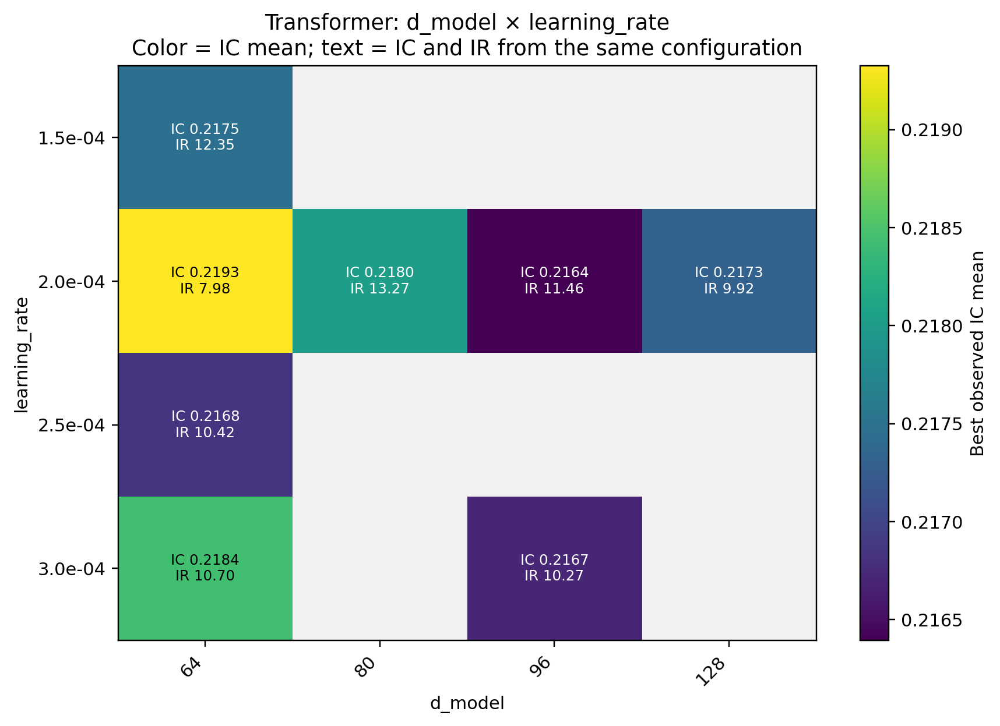
</p>

<p align="center">
  <em><b>Figure 10.</b> Transformer model dimension and learning-rate configurations.</em>
</p>

<p align="center">
  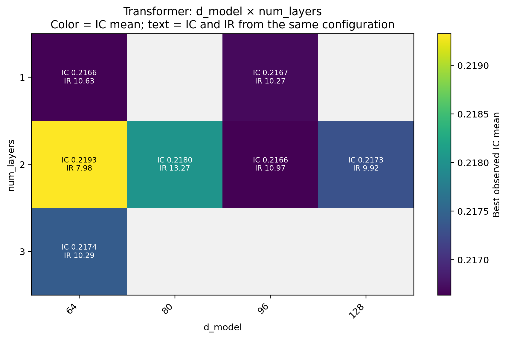
</p>

<p align="center">
  <em><b>Figure 11.</b> Transformer model dimension and encoder-layer configurations.</em>
</p>

<p align="center">
  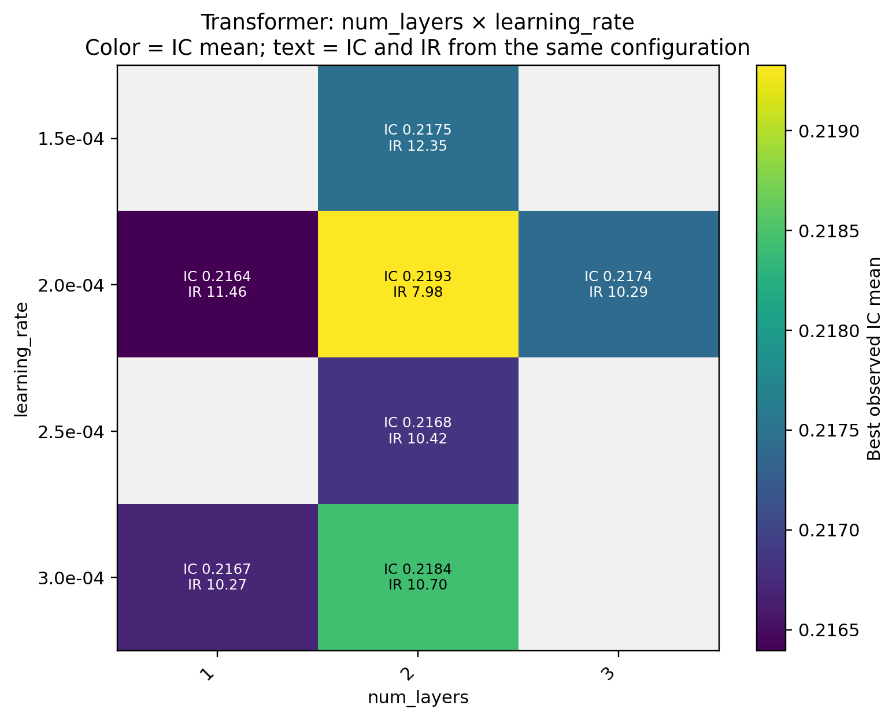
</p>

<p align="center">
  <em><b>Figure 12.</b> Transformer encoder-layer and learning-rate configurations.</em>
</p>

<p align="center">
  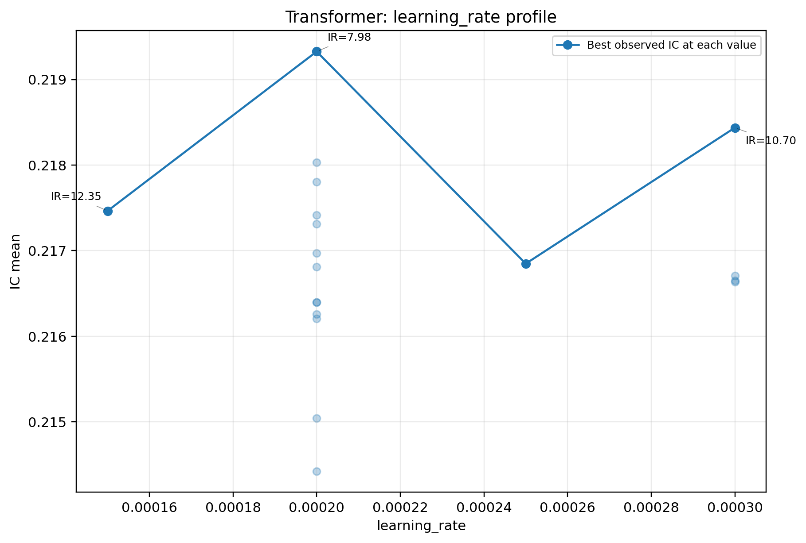
  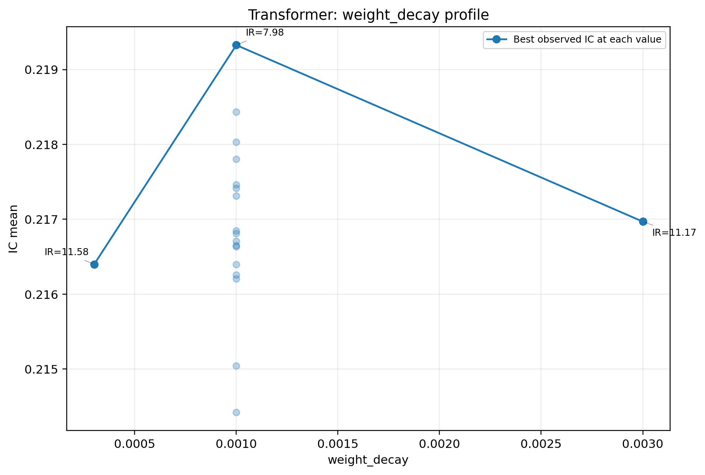
</p>

<p align="center">
  <em><b>Figure 13.</b> Best observed Transformer IC at each learning-rate and weight-decay value.</em>
</p>

The local search identifies $d_{\mathrm{model}}=80$, two encoder layers, and a learning rate of $2\times10^{-4}$ as the region with the strongest observed balance between IC and IR. Models with more encoder layers or hidden dimensions do not produce a consistent improvement, suggesting that a large Transformer architecture may lead to overfitting when processing input made of 8-step sequences.

Note that longer training can increase peak IC but may also increase cross-day variation. One epoch-4 configuration reaches an IC of 0.21933, but its IR falls to 7.98. Epoch 2 is therefore retained as the baseline setting as explained in this [previous section](#epoch-selection-and-early-stopping).


<p align="center">
  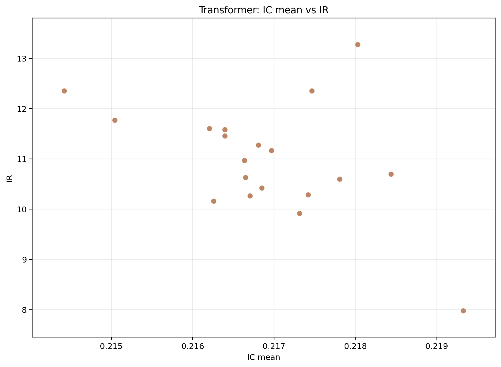
</p>

<p align="center">
  <em><b>Figure 14.</b> Validation IC mean and IR across Transformer configurations.</em>
</p>

Transformer configurations occupy a relatively concentrated region of the IC–IR space, although this partly reflects the more targeted search used for this model family.

#### Pooling Comparison

<p align="center">
  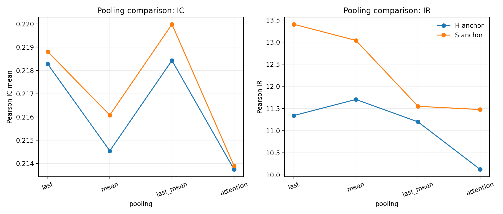
</p>

<p align="center">
  <em><b>Figure 15.</b> IC and IR comparison across selected Transformer pooling methods.</em>
</p>

<p align="center">
  <em><b>Table 13.</b> Validation comparison of Transformer pooling methods.</em>
</p>

| Pooling | IC mean | IC std | IR |
| :--- | :---: | :---: | :---: |
| `last` | **0.21881** | **0.01632** | **13.41** |
| `mean` | 0.21608 | 0.01657 | 13.04 |
| `last_mean` | **0.21999** | 0.01905 | 11.55 |
| `attention` | 0.21389 | 0.01864 | 11.48 |


The pooling results are broadly consistent across the retained Transformer configurations. `last` and `last_mean` pooling achieve the strongest IC values, while mean pooling gives a lower IC and learned attention pooling performs worst overall.

Within the pooling comparison, `last_mean` pooling produces the highest observed IC, reaching approximately 0.2200. However, `last` pooling produces more stable daily performance. It produces a slightly lower IC of approximately 0.2188, but also gives the highest IR of 13.41.

These results suggest that the final temporal position already contains an effective summary of the 8-step sequence after self-attention. Combining the final and average representations can extract a small amount of additional predictive signal, but it also increases variation across validation days. Note that attention pooling does not improve performance, suggesting that an additional weighting mechanism after Transformer self-attention adds unnecessary complexity and may lead to overfitting.

Therefore, `last` pooling is selected for the main Transformer because it provides the strongest balance between IC and stability. The `last_mean` variant is retained as a higher-IC alternative for the later model-complementarity and fusion analysis.

#### Sequence-Length Ablation

The sequence length determines how many consecutive observations are provided to the Transformer for each prediction. Longer sequences offer more historical context, but may also introduce less relevant or noisier information.

To isolate this effect, the fixed internal preprocessing protocol was held constant together with $d_{\mathrm{model}}=80$, 4 attention heads, 2 encoder layers, last-token pooling, batch size 4,096, learning rate $2\times10^{-4}$, and MSE + Pearson IC loss.

<p align="center">
  <em><b>Table 14.</b> Transformer sequence-length ablation.</em>
</p>

| Sequence Length | Validation IC | IC Standard Deviation | IR |
| :---: | :---: | :---: | :---: |
| 2 | 0.21665 | 0.02207 | 9.82 |
| 4 | 0.22055 | 0.02167 | 10.18 |
| 6 | 0.22044 | 0.02285 | 9.65 |
| **8** | **0.22151** | **0.02138** | **10.36** |
| 10 | 0.22336 | 0.02281 | 9.79 |


The project first retains configurations whose validation IC is within $0.003$ of the highest observed IC, as introduced in [previous section](#model-selection-rule):

$$
\mathcal C
=
\left\{
m:
\operatorname{IC}_m
\ge
\operatorname{IC}_{\max}-0.003
\right\}.
$$

Among these near-optimal candidates, the configuration with the highest IR is selected.

Sequence lengths 4, 6, 8, and 10 satisfy the IC threshold. Sequence length 8 achieves the highest IR and the lowest IC standard deviation among them, while maintaining an IC close to the maximum.

Therefore, **sequence length 8** is selected as the default Transformer configuration. The results suggest that short sequences provide insufficient temporal context, while extending the window beyond 8 produces only a small IC improvement at the cost of lower daily stability.

#### Selected Transformer Configuration

<p align="center">
  <em><b>Table 15.</b> Selected Transformer configuration.</em>
</p>

| Parameter | Value | Parameter | Value |
| :--- | :---: | :--- | :---: |
| Sequence length | 8 | Selected epoch | 2 |
| $d_{\mathrm{model}}$ | 80 | Attention heads | 4 |
| Encoder layers | 2 | Feed-forward dimension | 160 |
| Pooling | Last | Prediction-head size | 64 |
| Dropout | 0.10 | Batch size | 4,096 |
| Learning rate | $2\times10^{-4}$ | Weight decay | $1\times10^{-2}$ |
| IC-loss weight | 0.15 | | |
| Validation IC | **0.21881** | Validation IC standard deviation | **0.01632** |
| Validation IR | **13.41** | Candidate label | S |

The selected model is referred to as **Transformer-Balanced**. The corresponding last-mean model is retained as **Transformer-Peak**, with an IC of 0.21999 and an IR of 11.55.

# Hybrid Models

## GRU + MLP
### Model Design

GRU+MLP is a hybrid model that combines the structure of MLP and GRU models.
After applying the same fixed internal preprocessing used by the earlier nonlinear models, I combine MLP and GRU by **concatenating their branch outputs and passing the combined representation through a fully connected fusion head.**

The GRU+MLP model treats current-state information and recent temporal information as complementary sources of signal. The MLP branch processes the current feature vector and learns nonlinear relationships within the current-state representation, while the GRU branch learns short-term temporal dependencies by compressing the sequence into a recurrent hidden state.

Let $x_t$ denote the current feature vector and $x_{t-k:t}$ denote the recent sequence ending at time $t$. The two branches can be summarized as:

$$
h_{\mathrm{MLP}} = f_{\mathrm{MLP}}(x_t)
$$

$$
h_{\mathrm{GRU}} = \operatorname{GRU}(x_{t-k:t})
$$

After processing MLP and GRU separately, the model combines them only after each branch has extracted the information for which it is designed. Their learned representations are concatenated:

$$
z = [h_{\mathrm{GRU}}\,;\,h_{\mathrm{MLP}}]
$$

where $[\,;\,]$ denotes concatenation.

In this way, GRU+MLP retains the MLP's direct access to the current feature space while adding the temporal context captured by GRU. The final prediction is produced by a fully connected fusion network:

$$
\hat{y} = f_{\mathrm{fusion}}(z)
$$

Concatenation preserves both the temporal representation and the current-state representation. The fusion MLP then learns how much weight to place on each source and how their features interact. The predicted future return is therefore generated from a joint representation of recent market dynamics and the current market state.

### Loss Function

A standard regression model often minimizes mean squared error:

$$
\operatorname{MSE}(y,\hat{y})
$$

This objective is useful for numerical prediction accuracy, but it is not perfectly aligned with the primary evaluation metric, IC. Recall that Pearson IC measures the cross-sectional correlation between predicted and realized returns:

$$
\operatorname{IC}(y,\hat{y}) = \operatorname{Corr}(y,\hat{y})
$$

To make training more sensitive to this evaluation target, the experiments further introduce IC as an auxiliary objective. Note that Pearson IC is **mathematically differentiable**, so it can be used with backpropagation to train neural networks:

$$
\mathcal{L}({y,\hat{y}})
=
\operatorname{MSE}(y,\hat{y})
-
\lambda_{\mathrm{IC}}\operatorname{IC}(y,\hat{y}).
$$

Here, the hyperparameter $\lambda_{\mathrm{IC}}$ controls the trade-off between the two objectives.

IC does not replace MSE because correlation alone does not constrain prediction magnitude or absolute error, so predictions can be numerically inaccurate even when correlation is high. IC also relies on batch-level statistics such as mean centering and standard deviation. Thus, using IC alone as a neural-network loss can produce numerical instability and large gradients when the standard deviation of $y$ or $\hat{y}$ approaches zero. The combined loss therefore uses MSE and IC to stabilize training. Although the resulting objective is non-convex and does not guarantee a global optimum, it can be optimized empirically using **gradient-based optimization**.

### Parameter Analysis

The full experiment scatter shows that stronger configurations generally move toward higher IC and IR, but configurations with similarly high IC can still have different IR values. Therefore, both IC and IR are considered during parameter selection.

<p align="center">
  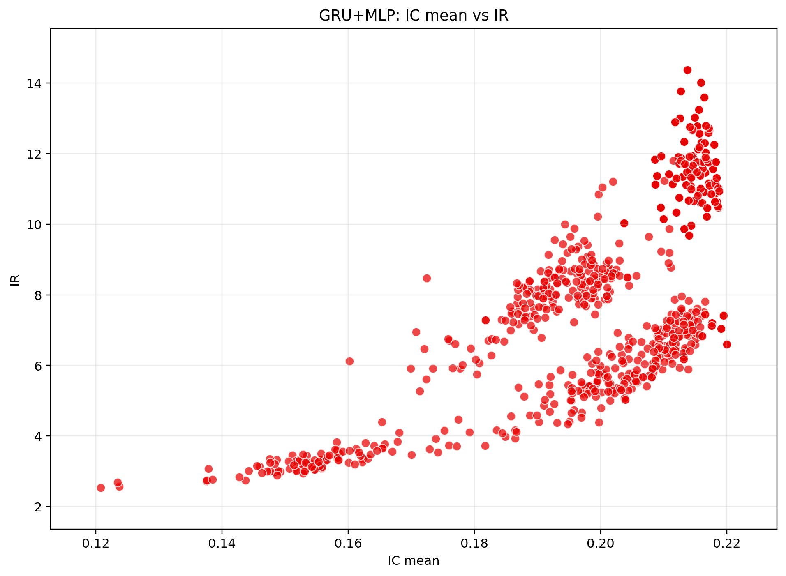
</p>

<p align="center">
  <em><b>Figure 16.</b> GRU+MLP IC mean versus IR across evaluated configurations.</em>
</p>

#### Model Capacity

The branch and fusion dimensions control how much information the model can represent. The following heatmap shows that increasing hidden sizes does not produce a monotonic improvement: a larger current or fusion layer can raise peak IC in one configuration but reduce it in another. Also, as shown in Figure 17, using an overly large projection layer may reduce peak IC, indicating that additional capacity may increase model variance. Therefore, an ideal configuration should balance the sizes of the projection, current, and fusion layers rather than maximize every hidden dimension independently.

<p align="center">
  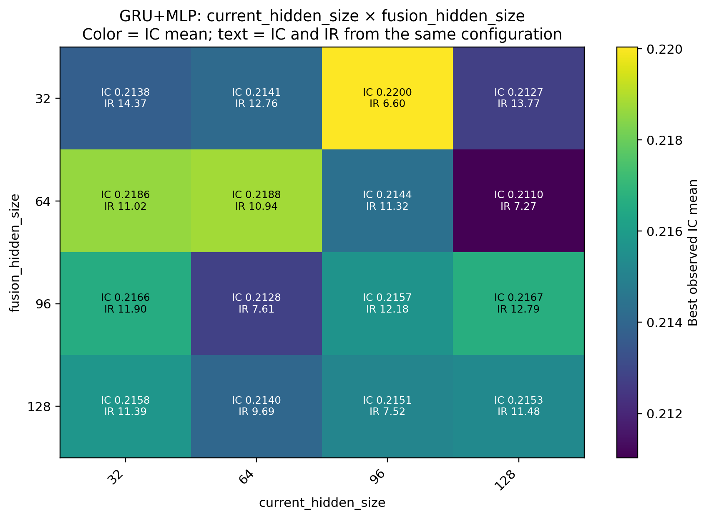
  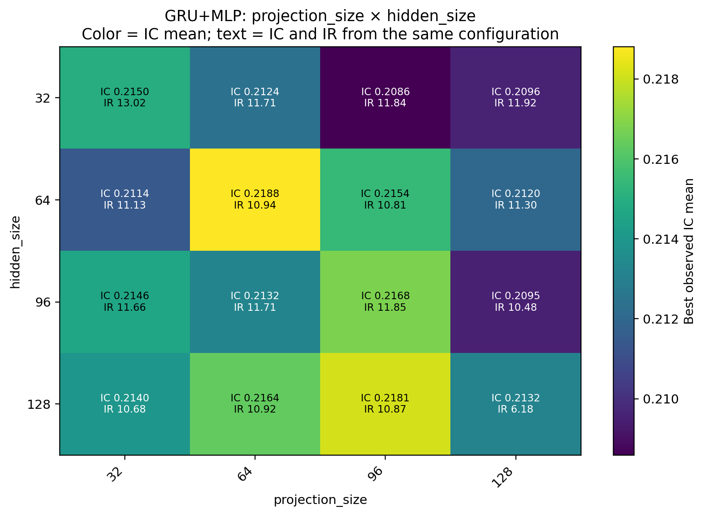
</p>

<p align="center">
  <em><b>Figure 17.</b> GRU+MLP peak IC under selected branch and fusion hidden-layer sizes.</em>
</p>

#### Optimization

The learning-rate and weight-decay heatmap shows that moderate optimization and regularization provide the most useful IC-IR balance. Note that configurations that update the network more aggressively may reach a strong IC peak but produce lower daily correlation stability. However, in general, GRU+MLP often achieves a higher IR than the standalone MLP or GRU configurations evaluated here.  As shown in Figure 18, higher weight decay rate can prevent overfitting by shrinking weights toward zero, but it can also suppress useful signal. The result supports selecting learning rate and weight decay jointly rather than tuning either parameter only for optimizing IC.

<p align="center">
  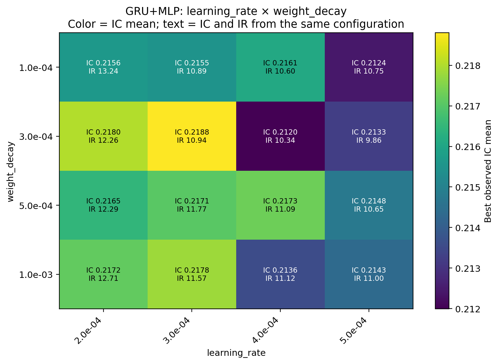
</p>

<p align="center">
  <em><b>Figure 18.</b> GRU+MLP learning-rate and weight-decay comparison.</em>
</p>

#### IC Loss Weight

Recall that changing $\lambda_{\mathrm{IC}}$ shifts emphasis from pointwise numerical fit toward the IC objective. The profile does not show a monotonic benefit from increasing the IC-loss weight, supporting the combined loss formulation introduced [above](#loss-function). Note that a moderate $\lambda_{\mathrm{IC}}$ allows the model to adjust $\hat{y}$ based on batch-level IC estimate and MSE, while preserving the numerical accuracy of $\hat{y}$. Therefore, $\lambda_{\mathrm{IC}}$ should be treated as a tuning parameter rather than assuming that a larger IC term is always better.

<p align="center">
  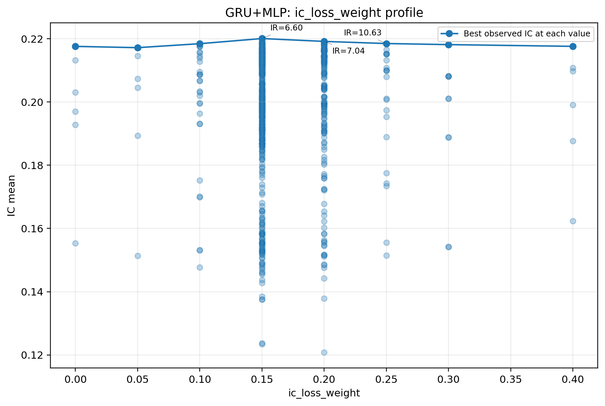
</p>

<p align="center">
  <em><b>Figure 19.</b> GRU+MLP performance under different IC-loss weights, $\lambda_{\mathrm{IC}}$.</em>
</p>

### Selected GRU + MLP Configuration

<p align="center">
  <em><b>Table 16.</b> Selected GRU+MLP configuration.</em>
</p>

| Parameter | Value | Parameter | Value |
| :--- | :---: | :--- | :---: |
| Sequence length | 8 | Selected epoch | 2 |
| Input projection size | 64 | GRU hidden size | 64 |
| GRU layers | 1 | Current-branch hidden size | 64 |
| Fusion-head size | 64 | Dropout | 0.05 |
| Batch size | 2,048 | Learning rate | $3\times10^{-4}$ |
| Weight decay | $3\times10^{-4}$ | IC-loss weight | 0.15 |
| Epochs trained | 6 |  |  |
| Validation IC | **0.21880** | Validation IR | **10.94** |

Although the highest observed validation IC is **0.22004**, that configuration has a substantially lower IR of **6.60**, indicating weaker consistency across validation days. The selected configuration therefore sacrifices only a small amount of IC while providing a better balance between predictive strength and stability.


## CNN + MLP

### Model Design

CNN+MLP combines a 1-D convolutional branch with a current-state MLP branch. Both branches use the same preprocessed input representation. The main difference between GRU+MLP and CNN+MLP is how the temporal branch processes the 8-step sequence.

Let

$$
X
=
[x_{t-7},\ldots,x_t]
$$

denote the recent sequence and let $x_t$ denote the current feature vector. Each temporal position is first mapped into a lower-dimensional representation:

$$
u_s
=
x_sW_{\mathrm{projection}}
+
b_{\mathrm{projection}}
$$

The temporal branch then applies stacked causal convolutions:

$$
H_{\mathrm{CNN}}
=
f_{\mathrm{CNN}}
\left(
u_{t-7:t}
\right).
$$

Causal padding ensures that the representation at a temporal position does not use information from later positions. The selected convolutional stack uses kernel sizes

$$
[3,3,3]
$$

and dilation rates

$$
[1,2,1].
$$

Its receptive field is therefore

$$
R
=
1+
\sum_{\ell=1}^{3}
(k_\ell-1)d_\ell
=
1+2(1+2+1)
=
9.
$$

Since the input sequence contains eight positions, the final convolutional representation can incorporate the entire sequence. Hence, last pooling is applied to obtain the temporal branch output:

$$
h_{\mathrm{CNN}}
=
H_{\mathrm{CNN},t}.
$$

The current branch processes only the latest feature vector:

$$
h_{\mathrm{current}}
=
f_{\mathrm{current}}(x_t).
$$

The two representations are concatenated and passed through the fusion head:

$$
z
=
[
h_{\mathrm{CNN}};
h_{\mathrm{current}}
],
\qquad
\hat{y}
=
f_{\mathrm{fusion}}(z).
$$

The CNN branch detects short temporal patterns such as local changes, reversals, and persistent movements, while the current branch analyzes the latest state. The model uses the same combined training objective introduced [here](#loss-function).

Unlike GRU, the CNN does not compress the sequence through recurrent state updates. It applies temporal filters to all positions in parallel and uses a fixed receptive field. This makes its behavior particularly dependent on the balance between the input projection, convolutional channels, and fusion capacity.

### Parameter Analysis

#### IC–IR Tradeoff

The full-configuration scatter reveals a clear trade-off between IC and IR, with no single configuration achieving the best performance on both metrics.

<p align="center">
  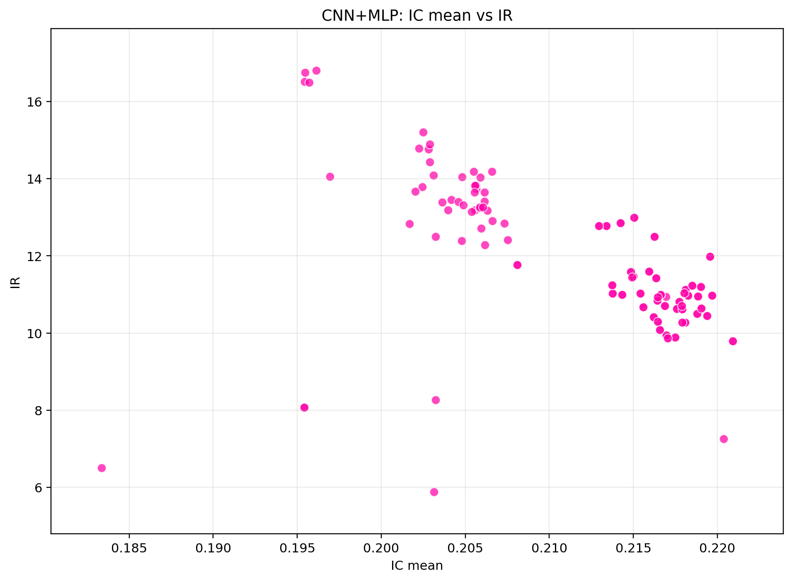
</p>

<p align="center">
  <em><b>Figure 20.</b> CNN+MLP validation IC and IR across the evaluated configurations.</em>
</p>

Across all evaluated experiments, IC and IR have a correlation of approximately $-0.54$. Very high-IC configurations therefore tend to have lower IR, whereas some highly stable configurations sacrifice a substantial amount of IC.

The highest-IC configuration has

$$
\mathrm{IR}=9.80.
$$

However, based on the [model selection rule](#model-selection-rule), the selected model produces

$$
\mathrm{IC}=0.21956,
\qquad
\mathrm{IR}=11.98.
$$

Compared to the model that produces the best IC, the selected model gives up only about $0.00136$ of IC while gaining approximately $2.18$ in IR.

#### Projection and Convolutional Capacity

The projection layer and convolutional channels control two different stages of temporal representation learning. The projection determines how much information is retained when the preprocessed input enters the temporal branch, whereas the channel width controls how many temporal filters are maintained by the convolutional stack.

<p align="center">
  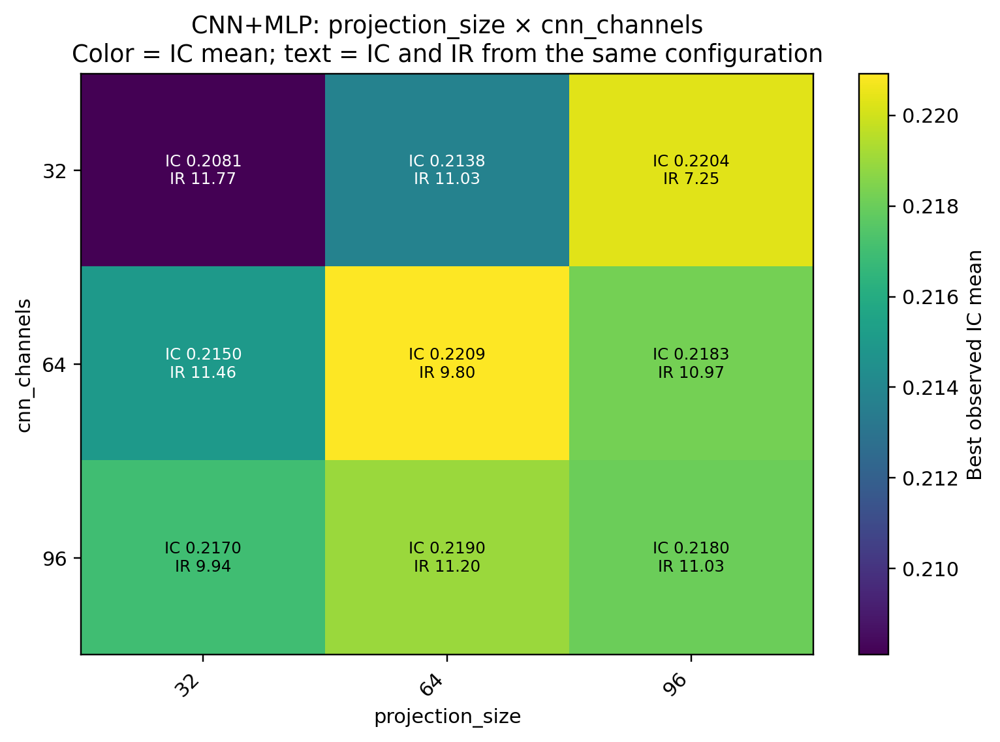
  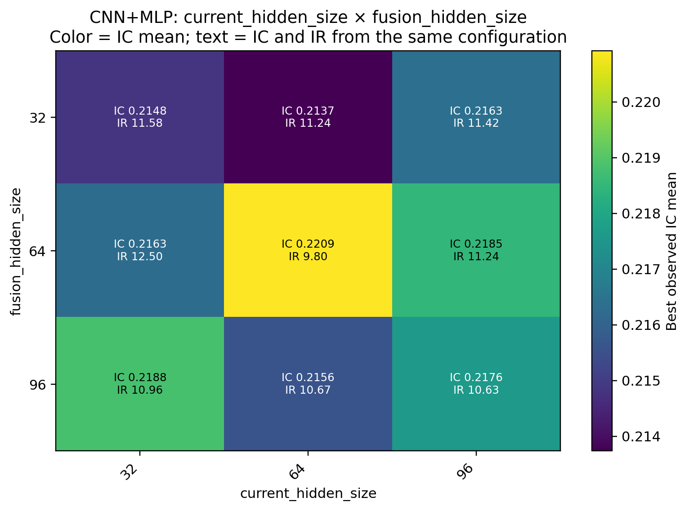
</p>

<p align="center">
  <em><b>Figure 21.</b> Interaction between CNN+MLP temporal-branch capacity and current/fusion branch dimensions.</em>
</p>

The projection–channel heatmap shows that a wider network does not necessarily produce better IC. A small $32\times32$ temporal representation performs poorly, but increasing both dimensions to $96\times96$ also fails to produce the best result.

Across the experiments, I observed that:

- a balanced $64$-dimensional projection with $64$ CNN channels produces the highest isolated IC;
- a wider $96$-dimensional projection followed by $32$ CNN channels also performs strongly and gives the best result under the project-wide model selection rule.

The selected $96\rightarrow32$ structure initially preserves a relatively rich hidden representation, while the narrower convolutional layers restrict the number of temporal filters. This suggests that the model benefits from preserving information before applying a more selective temporal transformation.

Increasing current and fusion dimensions does not produce a consistent improvement in model performance. A fusion size of $32$ is consistently restrictive because it must combine two branch representations in a very small space. Increasing the fusion layer to $64$ produces a large improvement, but increasing both the current and fusion layers to $96$ fails to add further benefit.

The $64\times64$ current/fusion configuration produces the highest isolated IC. However, the $32\times96$ and $96\times64$ combinations also perform well. This suggests that a smaller current branch can be compensated by a wider fusion head, and vice versa.

>
>The heatmaps report the best observed result within each parameter cell. A cell may therefore reflect a different batch size or selected epoch from the final model. The final configuration table applies the **[project-wide model selection rule](#model-selection-rule)** to the complete run-level candidates.

#### Learning Rate and Weight Decay


<p align="center">
  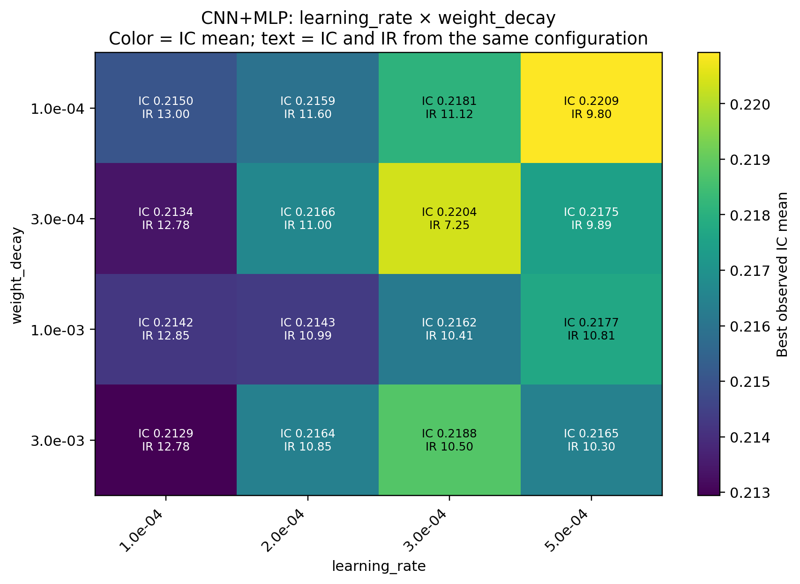
</p>

<p align="center">
  <em><b>Figure 22.</b> Joint effect of CNN+MLP learning rate and weight decay.</em>
</p>

<p align="center">
  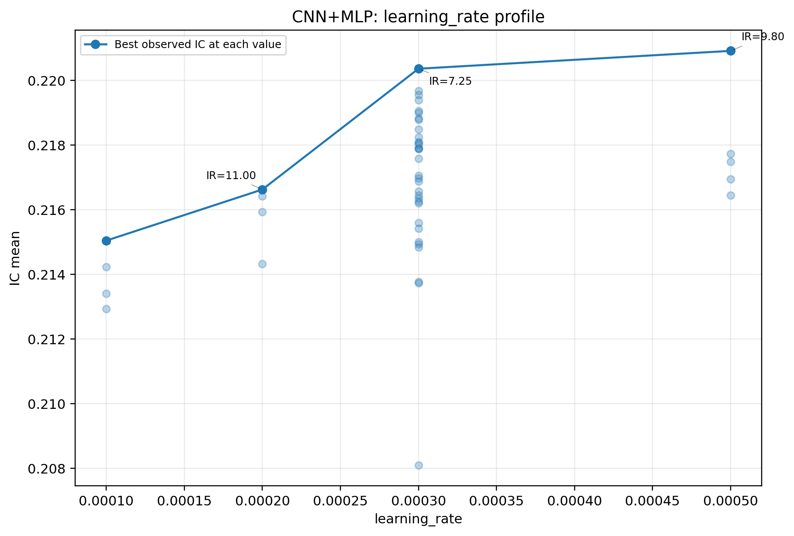
  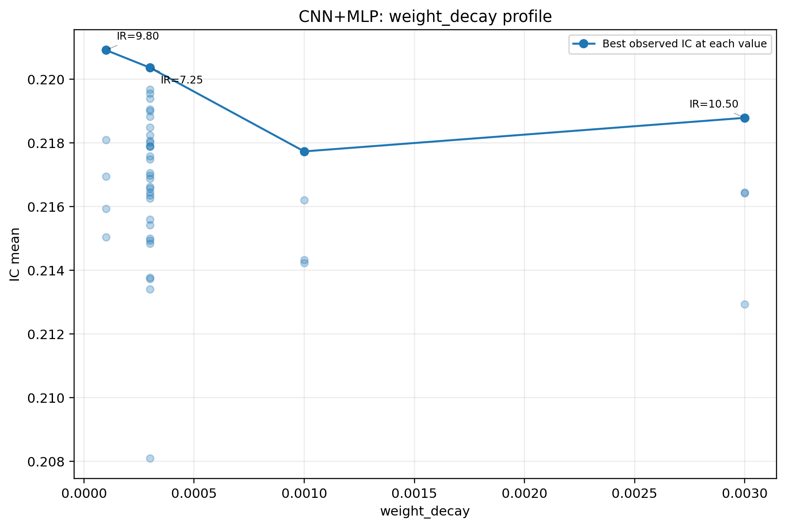
</p>

<p align="center">
  <em><b>Figure 23.</b> Best observed CNN+MLP IC profiles for learning rate and weight decay.</em>
</p>

At a learning rate of $10^{-4}$, the model produces relatively high IR but lower IC, indicating that a low learning rate may not be sufficient for the convolutional filters to learn the strongest temporal signal. Increasing the learning rate accelerates this process and raises peak IC.

The highest IC occurs at

$$
\text{learning rate}=5\times10^{-4},
\qquad
\text{weight decay}=10^{-4},
$$

but its IR is lower than that of several configurations with moderate learning rate. The selected model instead uses

$$
\text{learning rate}=3\times10^{-4},
\qquad
\text{weight decay}=3\times10^{-4}.
$$

The effect of weight decay depends on the learning rate: strong decay may suppress useful convolutional filters, while weak decay combined with a large learning rate can produce a higher but less stable IC. The heatmap indicates that weight decay mainly modifies the behavior established by the learning rate rather than determining performance independently.

This sensitivity is consistent with the CNN architecture. Shared temporal filters are updated across every sequence position, so useful patterns can be learned rapidly, but aggressive updates can also amplify a small set of filters too strongly.

#### Dropout and IC-Loss Weight

The auxiliary IC term is retained from the preceding neural-model experiments, but the CNN+MLP results reveal how dropout interacts with different auxiliary IC weights.

<p align="center">
  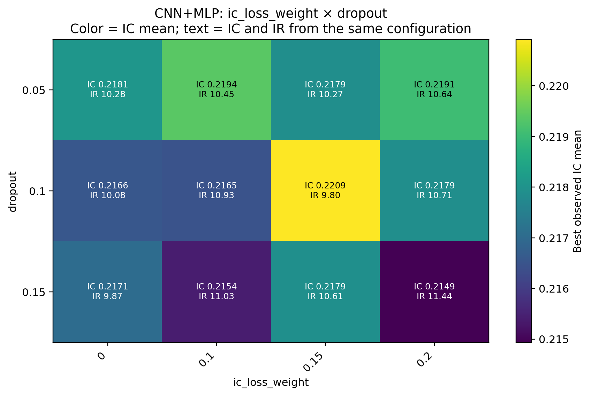
</p>

<p align="center">
  <em><b>Figure 24.</b> Interaction between the CNN+MLP IC-loss weight and dropout.</em>
</p>

<p align="center">
  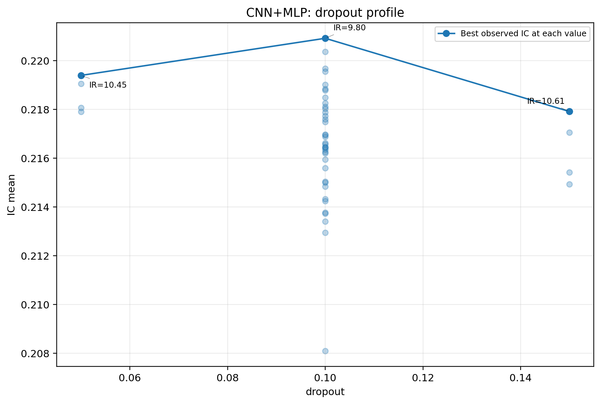
  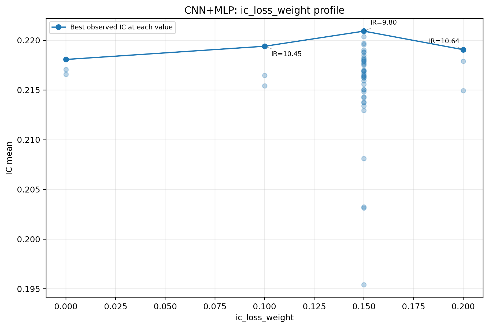
</p>

<p align="center">
  <em><b>Figure 25.</b> Best observed CNN+MLP IC profiles for dropout and the auxiliary IC-loss weight.</em>
</p>

A moderate auxiliary weight improves the strongest observed result, but the benefit depends on how much dropout is applied. The global IC peak occurs at

$$
\lambda_{\mathrm{IC}}=0.15,
\qquad
\text{dropout}=0.10.
$$

However, dropout $0.05$ produces comparatively strong results across several values of $\lambda_{\mathrm{IC}}$, making it an alternative candidate. Increasing dropout to $0.15$ generally reduces IC, especially when combined with a larger IC-loss weight.

This suggests that the two regularizers should be tuned jointly. The auxiliary IC term changes the direction of the training gradients, while dropout changes how reliably the two branches can preserve and combine their learned representations. Excessive regularization can weaken the compressed temporal signal before it reaches the fusion head.

#### Epoch and Batch Size

CNN+MLP learns most of its useful signal very quickly.

<p align="center">
  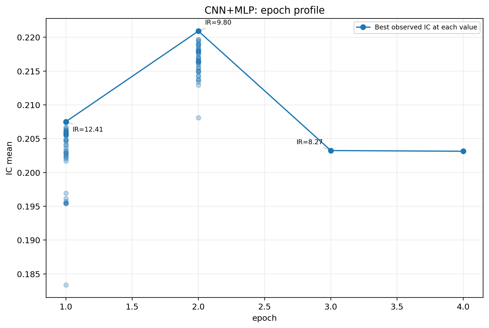
  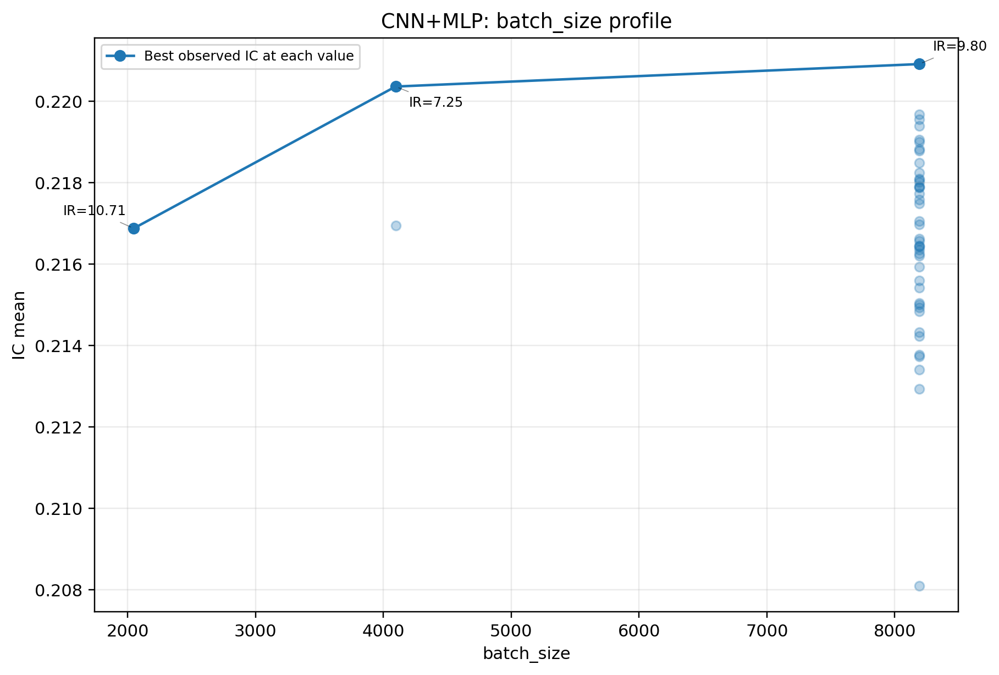
</p>

<p align="center">
  <em><b>Figure 26.</b> Best observed CNN+MLP validation performance by epoch and batch size.</em>
</p>

The best observed IC rises substantially from epoch 1 to epoch 2. Among the 46 run-level summaries, 45 select epoch 2, while only 1 longer run selects a later checkpoint. Hence, these figures support early stopping at epoch 2, but do not imply that every possible CNN+MLP configuration must deteriorate after epoch 2.

Epoch 2 is therefore used as the default CNN+MLP checkpoint, which is consistent with other [neural models](#epoch-selection-and-early-stopping). The convolutional branch has already covered the full sequence at every forward pass, so it can learn useful local filters without the gradual recurrent-state adaptation required by GRU. Additional epochs increase computation and may reinforce configuration-specific patterns rather than improve generalization.

The selected model uses a batch size of 8192. This is larger than the batch used by the selected GRU+MLP model and is practical because temporal convolutions can process sequence positions in parallel. A larger batch also provides a more stable batch-level IC estimate for reducing the auxiliary IC loss. Note that the profile does not establish a universal monotonic improvement with batch size since most experiments use 8192, and only a small number of experiments use 2048 or 4096.

### Selected CNN + MLP Configuration

<p align="center">
  <em><b>Table 17.</b> Selected CNN+MLP configuration.</em>
</p>

| Parameter | Value | Parameter | Value |
| :--- | :---: | :--- | :---: |
| Sequence length | 8 |  |  |
| Input projection size | 96 | CNN channels | $[96,32,32]$ |
| Kernel sizes | $[3,3,3]$ | Dilations | $[1,2,1]$ |
| Temporal pooling | Last | Current hidden size | 64 |
| Fusion hidden size | 64 | Dropout | 0.10 |
| Batch size | 8,192 | Learning rate | $3\times10^{-4}$ |
| Weight decay | $3\times10^{-4}$ | IC-loss weight | 0.15 |
| Epochs trained | 2 | Selected epoch | 2 |
| Validation IC | **0.21956** | Validation IR | **11.98** |

The selected architecture uses a relatively wide input projection, followed by a compact convolutional stack that reduces the temporal channel width from 96 to 32. The model then combines the extracted temporal representation with a 64-dimensional current-state representation through the fusion layer. 

## Correlation-Based Motivation for Neural Fusion

After evaluating the neural models individually, I examine whether different models capture complementary information. Two models with similar strong performance may be poor fusion candidates if they become strong and weak on the same dates. Conversely, a slightly weaker model may be useful if its prediction behavior differs systematically from that of the strongest and most stable model.

Recall that for model $m$ on validation date $t$, the daily cross-sectional Pearson IC is defined as

$$
IC_{m,t}
=
\operatorname{Corr}_i
\left(
\hat{y}^{(m)}_{i,t},
y_{i,t}
\right),
$$

where $i$ indexes the evaluation samples used to compute cross-sectional IC on date $t$. All selected representative models cover the same 15 validation dates, allowing their daily-IC series to be aligned directly.

<p align="center">
  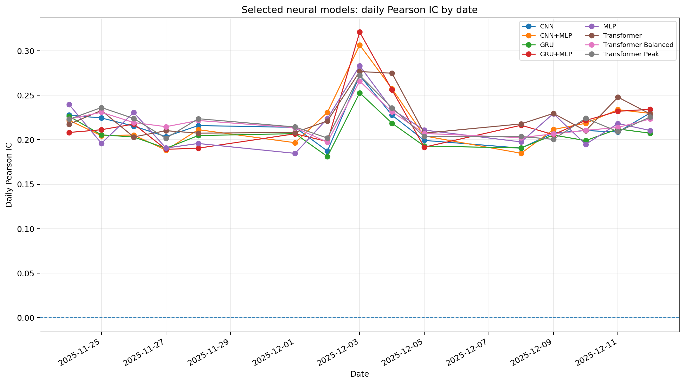
</p>

<p align="center">
  <em><b>Figure 27.</b> Daily Pearson IC of the neural-model representatives used for complementarity analysis over the same 15-date validation period.</em>
</p>

The first complementarity diagnostic calculates the correlation between the daily-IC series of models $m$ and $k$. The analysis uses representative candidate series retained from the preceding experiments; these are not necessarily the final configuration selected within each model family.

$$
r_{m,k}
=
\operatorname{Corr}_t
\left(
IC_{m,t},
IC_{k,t}
\right).
$$

This correlation measures whether two models tend to perform well and poorly on the same validation dates. A high value indicates similar date-level behavior, while a lower value suggests that the models may respond differently to changing market conditions.

<p align="center">
  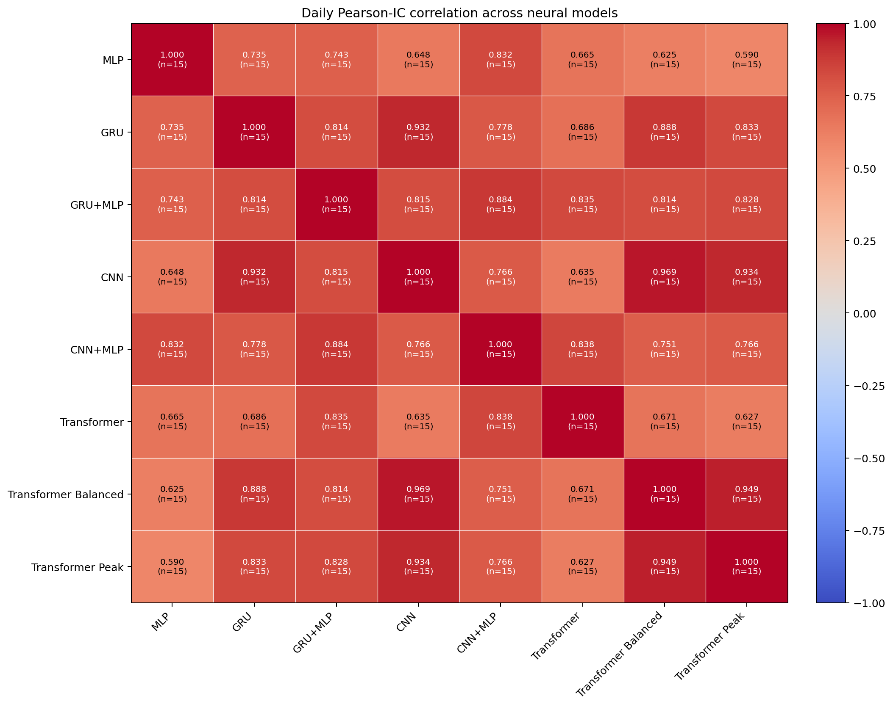
</p>

<p align="center">
  <em><b>Figure 28.</b> Pairwise correlation of daily Pearson IC across the selected neural models.</em>
</p>

The selected representative models are summarized below.


> 
> All representatives use the selected configuration from their respective model families. Table 18 reports the IC and IR from the specific validation runs used to construct the aligned daily-IC series for correlation analysis, so these run-level metrics may differ from the headline results reported earlier.

<p align="center">
  <em><b>Table 18.</b> Neural-model representatives used for complementarity analysis.</em>
</p>

| Model | Mean IC | IC Standard Deviation | IR | Correlation with Transformer Balanced | Unexplained Share $1-r^2$ |
| :--- | ---: | ---: | ---: | ---: | ---: |
| **MLP** | 0.21598 | 0.02553 | 8.46 | **0.625** | **61.0%** |
| GRU | 0.20647 | 0.01715 | 12.04 | 0.888 | 21.1% |
| GRU+MLP | 0.22004 | 0.03335 | 6.60 | 0.814 | 33.8% |
| CNN | 0.21566 | 0.02030 | 10.63 | 0.969 | 6.2% |
| CNN+MLP | 0.22037 | 0.03039 | 7.25 | 0.751 | 43.6% |
| Transformer | 0.22626 | 0.02345 | 9.65 | 0.671 | 54.9% |
| **Transformer Balanced** | **0.21881** | **0.01632** | **13.41** | 1.000 | 0.0% |
| Transformer Peak | 0.21999 | 0.01905 | 11.55 | 0.949 | 9.9% |

Transformer Balanced is used as the fusion anchor because it combines a competitive IC with the lowest daily IC variability (highest IR) among the selected Transformer configurations. The initial correlation analysis identifies MLP as the most distinct fusion candidate: its daily-IC correlation with Transformer Balanced is only $0.625$, which is lower than that of GRU, CNN, or Transformer Peak.

<p align="center">
  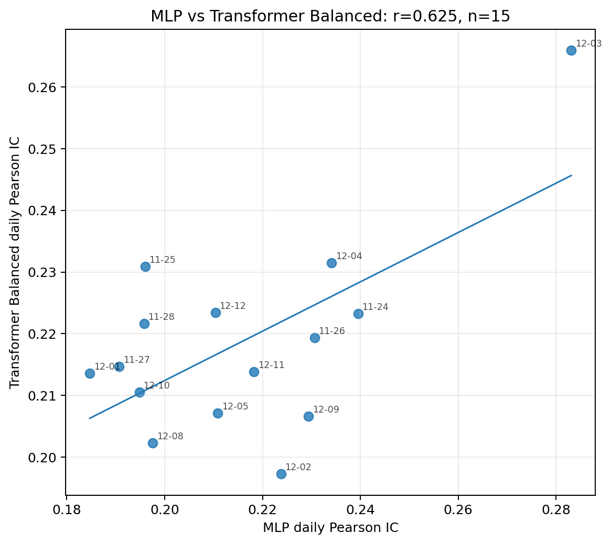
</p>

<p align="center">
  <em><b>Figure 29.</b> MLP daily Pearson IC versus Transformer Balanced; each point represents one validation date.</em>
</p>

However, raw correlation can be partly driven by a common market environment. For example, an unusually easy or difficult date may raise or lower the IC of most neural models simultaneously. To measure the incremental information provided by each candidate model beyond the Transformer component, the daily IC series of each candidate model is regressed against the Transformer Balanced daily-IC series:

$$
IC_{m,t}
=
a_m
+
\beta_m IC_{T,t}
+
\varepsilon_{m,t},
$$

where $T$ denotes the Transformer Balanced model. The fitted component
$$
a_m+\beta_m IC_{T,t}
$$

represents the regression-predicted daily IC of candidate model $m$ based on the Transformer Balanced daily-IC series. It captures the portion of candidate $m$'s daily IC variation that can be explained by the Transformer component, while the residual term

$$
\varepsilon_{m,t}
$$

represents the remaining component that may contain additional information beyond the Transformer branch.

Because this is a single-variable linear regression with an intercept,

$$
R_m^2
=
\operatorname{Corr}_t
\left(
IC_{m,t},
IC_{T,t}
\right)^2.
$$

$R_m^2$ measures how much of the candidate model's daily IC variation can be explained by its linear relationship with the Transformer Balanced daily IC series.

The unexplained share is therefore

$$
U_m
=
1-R_m^2.
$$

For MLP,

$$
U_{\mathrm{MLP}}
=
1-0.625^2
\approx
0.61,
$$

This indicates that approximately $61.0\%$ of its date-to-date IC variation is not linearly explained by Transformer Balanced. By comparison, only $6.2\%$ of CNN variation and $9.9\%$ of Transformer Peak variation remain unexplained.

<p align="center">
  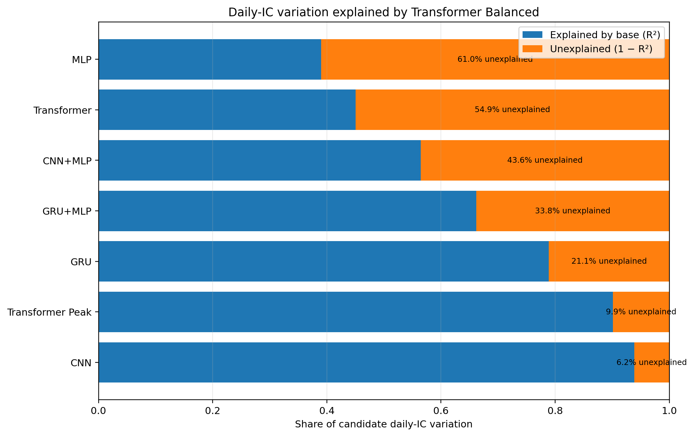
</p>

<p align="center">
  <em><b>Figure 30.</b> Share of each candidate's daily-IC variation explained and unexplained by Transformer Balanced.</em>
</p>

The residual series can also be compared across candidate models:

$$
\rho^{\mathrm{res}}_{m,k}
=
\operatorname{Corr}_t
\left(
\varepsilon_{m,t},
\varepsilon_{k,t}
\right).
$$

The residual correlation $\rho^{\mathrm{res}}_{m,k}$ shows whether two candidates still share similar strong and weak dates after controlling for the variation associated with Transformer Balanced.

<p align="center">
  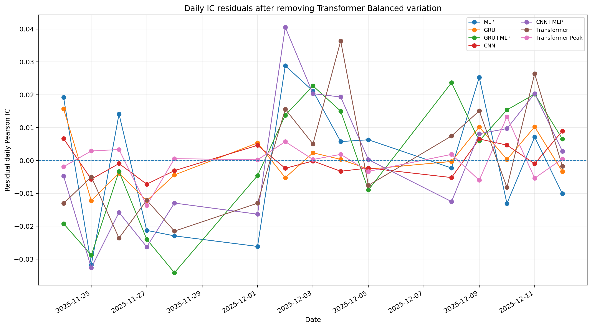
</p>

<p align="center">
  <em><b>Figure 31.</b> Candidate daily-IC residuals after controlling for variation associated with Transformer Balanced.</em>
</p>

<p align="center">
  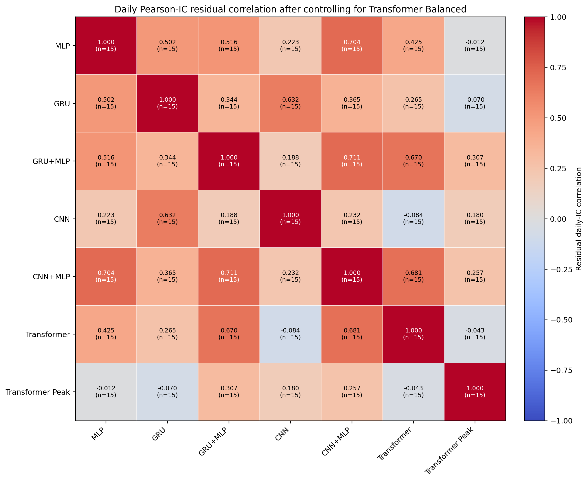
</p>

<p align="center">
  <em><b>Figure 32.</b> Correlation among candidate residual daily-IC series after controlling for Transformer Balanced.</em>
</p>

Several patterns motivate the fusion design:

- **MLP has both the lowest raw correlation with Transformer Balanced and the largest unexplained date-level variation among all candidates.**
- CNN and Transformer Peak are highly correlated with Transformer Balanced, suggesting that combining these models with Transformer Balanced may be redundant.
- GRU and CNN retain a residual correlation of $0.632$, indicating that the two temporal architectures may still share similar local temporal behavior.
- MLP and CNN+MLP retain a residual correlation of $0.704$, while GRU+MLP and CNN+MLP retain a correlation of $0.711$. This suggests that hybrid models containing an MLP branch may repeat part of the same current-state component.
- The ordinary Transformer candidate showed lower daily-IC correlation with Transformer Balanced, suggesting potentially different temporal behavior. However, it was selected from a Transformer search pool with multiple architectural differences, so this distinction may also arise from sequence length, hyperparameter variation, or selection noise, making it hard to interpret. Therefore, it is treated as an exploratory candidate rather than the primary fusion branch.

These diagnostics motivate the use of **Transformer Balanced as a stable base model and the pure MLP as a current-state correction branch**.

However, the daily-IC residual analysis identifies different date-level behavior but does not prove that a candidate predicts the exact sample-level target component missed by the base model. The purpose of this analysis is to select a plausible and interpretable architecture for the subsequent fusion experiments.

## Transformer-Anchored Gated Residual Fusion Design

The proposed fusion model combines two fixed backbone designs without changing their previously selected internal hyperparameters.

### Fusion Notation

<p align="center">
  <em><b>Table 19.</b> Notation used in the Transformer-anchored gated residual fusion model.</em>
</p>

| Symbol | Meaning | Symbol | Meaning |
| :---: | --- | :---: | --- |
| $T$ | Transformer branch | $M$ | Current-state MLP branch |
| $h^{(T)}_{i,t}$ | Transformer branch representation | $h^{(M)}_{i,t}$ | MLP branch representation |
| $z^{(T)}_{i,t}$ | Projected Transformer representation | $z^{(M)}_{i,t}$ | Projected MLP representation |
| $s^{(T)}_{i,t}$ | Base prediction from the Transformer branch | $\Delta_{i,t}$ | Residual correction proposed by the MLP branch |
| $g_{i,t}$ | Sample-dependent residual gate | $\tau$ | Gate temperature |
| $\alpha$ | Learned global residual scale | $\alpha_{\max}$ | Maximum residual scale |
| $\lambda_{\mathrm{IC}}$ | Weight of the auxiliary IC objective |  |  |

<p align="center">
  <em><b>Table 20.</b> Fixed backbone architectures and intended fusion roles.</em>
</p>

| Branch | Fixed Architecture | Intended Role |
| :--- | :--- | :--- |
| Transformer Balanced ($T$) | Sequence length 8, $d_{\mathrm{model}}=80$ (hidden dimension used to represent each temporal position), 4 attention heads, 2 encoder layers, FFN dimension 160, last pooling, 64-unit prediction head | Learn temporal interactions and provide the stable base prediction |
| MLP ($M$) | Current-position input, hidden layers $(64,32)$, ReLU activation | Learn nonlinear relationships from the current latent representation |

For sample $i$ on date $t$, the Transformer branch processes the complete sequence

$$
X_{i,t}
=
\left[
x_{i,t-7},
\ldots,
x_{i,t}
\right]
\in
\mathbb{R}^{8\times d_{\mathrm{in}}}
$$

and produces a temporal representation

$$
h^{(T)}_{i,t}
=
f_T(X_{i,t}).
$$

Its original prediction head produces the base score

$$
s^{(T)}_{i,t}
=
f^{(T)}_{\mathrm{head}}
\left(
h^{(T)}_{i,t}
\right).
$$

The MLP branch only receives the current position of the sequence:

$$
x^{(\mathrm{current})}_{i,t}
=
X_{i,t}[-1,:],
$$

and produces

$$
h^{(M)}_{i,t}
=
f_M
\left(
x^{(\mathrm{current})}_{i,t}
\right).
$$

Because the two branches have different representation dimensions, they are projected into a common 64-dimensional fusion space:

$$
z^{(T)}_{i,t}
=
\phi_T
\left(
P_T h^{(T)}_{i,t}
\right),
$$

$$
z^{(M)}_{i,t}
=
\phi_M
\left(
P_M h^{(M)}_{i,t}
\right),
$$

where each projection includes a linear transformation, normalization, nonlinear activation, and light dropout.

The MLP branch then generates a residual correction:

$$
\Delta_{i,t}
=
f_{\Delta}
\left(
z^{(M)}_{i,t}
\right).
$$

The correction is based on the MLP representation. It represents the current-state correction proposed as an addition to the Transformer prediction.

A sample-dependent scalar gate observes both branch representations:

$$
g_{i,t}
=
\sigma
\left(
\frac{
f_g
\left(
[z^{(T)}_{i,t};z^{(M)}_{i,t}]
\right)
}{
\tau
}
\right) ,
$$

where

- $\sigma(\cdot)$ is the sigmoid function;
- $g_{i,t}\in(0,1)$;
- $\tau$ is the gate temperature, which controls the sharpness of the sigmoid gate;
- $[z^{(T)};z^{(M)}]$ denotes representation concatenation;
- $f_g$ is a small MLP gate network that outputs a scalar gating value.

The gate uses both branches because the usefulness of an MLP correction may depend on how the current-state MLP representation relates to the Transformer state. However, the gate does not replace the Transformer prediction. It only controls the strength of the residual correction.

A bounded global residual scale is defined as

$$
\alpha
=
\alpha_{\max}\sigma(a),
$$

where $a$ is learned and $\alpha_{\max}$ limits the largest possible correction. The final prediction is

$$
\boxed{
\hat{y}_{i,t}
=
s^{(T)}_{i,t}
+
\alpha
g_{i,t}
\Delta_{i,t}
}
$$

Note that the global residual scale $\alpha$ controls the overall strength of the residual branch, while the sample-specific gate $g_{i,t}$ dynamically controls how much residual correction is applied for each observation.

This structure gives the Transformer branch an explicit anchor role. The MLP cannot freely replace the base prediction; it can only add a sample-dependent correction whose global scale is bounded. The initial residual scale is set near $0.05$, and the gate is initialized conservatively so that the model begins close to the original Transformer prediction.

The main structural configuration uses

<p align="center">
  <em><b>Table 21.</b> Main gated-residual fusion parameters.</em>
</p>

| Fusion Parameter | Main Value |
| :--- | :---: |
| Common projection dimension | 64 |
| Residual-head hidden size | 32 |
| Gate hidden size | 32 |
| Gate temperature $\tau$ | 1.0 |
| Initial residual scale $\alpha$ | 0.05 |
| Maximum residual scale $\alpha_{\max}$ | 0.25 |
| Initial gate bias | -2.0 |
| Transformer freeze period | 1 epoch (first fusion epoch) |
| Final-prediction IC-loss weight | 0.15 |

The training objective combines prediction error (MSE) with batch-level Pearson correlation (auxiliary IC term):

$$
\mathcal{L}
=
(1-\lambda_{\mathrm{IC}})
\operatorname{MSE}
\left(
\hat{y},y
\right)
+
\lambda_{\mathrm{IC}}
\left(
1-
\operatorname{Corr}
\left(
\hat{y},y
\right)
\right),
$$

with

$$
\lambda_{\mathrm{IC}}=0.15.
$$

MSE preserves prediction-scale stability, while the auxiliary IC term aligns optimization more directly with the Pearson-IC evaluation objective.

The Transformer and MLP branches are warm-started from their previously selected checkpoints. During the first fusion epoch, the Transformer base is frozen so that the newly initialized projection, residual, and gate layers first learn to use the existing representations without immediately modifying the stable temporal backbone. Limited end-to-end fine-tuning is allowed afterward.

The structural experiment is designed as an ablation study rather than a new search over the internal Transformer or MLP hyperparameters.

<p align="center">
  <em><b>Table 22.</b> Controlled structural ablations for the fusion design.</em>
</p>

| Experiment | Structure | Question Addressed |
| :--- | :--- | :--- |
| Transformer only | $s^{(T)}$ | What is the controlled base performance? |
| MLP only | $f_M(x_t)$ | How strong is the correction branch by itself? |
| Concatenation head | $f([z^{(T)};z^{(M)}])$ | Is unrestricted representation-level fusion sufficient? |
| Residual without gate | $s^{(T)}+\alpha\Delta$ | Does protecting the Transformer anchor improve stability? |
| Gated residual | $s^{(T)}+\alpha g\Delta$ | Does sample-dependent correction improve on a fixed residual? |
| Gate capacity | Hidden sizes $16,32,64$ | How much gate capacity is necessary? |
| Gate temperature | $\tau\in\{0.5,1,2\}$ | Should the gate be sharper or smoother? |
| Training schedule | Freeze-first versus immediate joint training | Does early backbone protection improve optimization? |
| Residual scale | Learned bounded scale versus fixed scale | How strongly should the correction be allowed to modify the base? |

All structural comparisons use the same fixed internal preprocessing. The independent test period is not used during correlation analysis or structural selection.

>
>The resulting experimental question is therefore narrowly defined:
> Can a current-state MLP provide a small, effective correction to a stable temporal Transformer, without replacing the base prediction or introducing an unnecessarily high-capacity fusion mechanism?

## Structural Fusion Screening

The first fusion stage was designed as a controlled structural screening experiment. The internal Transformer and MLP architectures were kept fixed, while only the way in which their representations were combined was changed.

All configurations used the same training set, validation set, sequence length, fixed internal preprocessing, and initial branch states. The independent test period remained untouched.

The controlled Transformer baseline is denoted by

$$
s^{(T)}_{i,t},
$$

while the prediction is generated by

$$
\hat{y}_{i,t}
=
s^{(T)}_{i,t}
+
\alpha g_{i,t}\Delta_{i,t},
$$

as mentioned in the [previous section](#transformer-anchored-gated-residual-fusion-design).

The structural configurations and their validation results are summarized below.

<p align="center">
  <em><b>Table 23.</b> Validation results of the structural fusion screening.</em>
</p>

| ID | Structural Change | Validation IC | IC Standard Deviation | IR | IC Uplift vs. F00 | Experimental Purpose |
| :--- | :--- | ---: | ---: | ---: | ---: | :--- |
| **F00** | Transformer Balanced only | 0.21942 | 0.02063 | 10.64 | N/A | Controlled temporal baseline |
| F01 | Current-state MLP only | 0.21391 | 0.01798 | 11.90 | -0.00551 | Measures the standalone strength of the correction branch |
| F02 | Unrestricted concatenation head | 0.22117 | 0.02069 | 10.69 | +0.00175 | Tests whether two branches can simply be concatenated and re-predicted |
| **F03** | MLP residual with bounded scale, without a gate | 0.22099 | 0.01870 | 11.82 | +0.00156 | Tests the contribution of the Transformer-anchored residual structure without gating |
| F04 | Gated residual, gate hidden size 16 | 0.22066 | 0.01857 | 11.88 | +0.00124 | Tests a gate with low capacity|
| **F05** | Gated residual, gate hidden size 32 | **0.22178** | 0.01871 | 11.85 | **+0.00236** | Main gated-residual configuration |
| **F06** | Gated residual, gate hidden size 64 | 0.22167 | **0.01860** | **11.92** | +0.00225 | Tests a gate with high capacity|
| F07 | Gate hidden size 32, temperature 0.5 | 0.22047 | 0.01873 | 11.77 | +0.00105 | Tests a sharper gate |
| F08 | Gate hidden size 32, temperature 2.0 | 0.22010 | 0.01854 | 11.87 | +0.00067 | Tests a smoother gate closer to a constant weight |
| F09 | Immediate joint training from epoch 1 | 0.22005 | 0.02042 | 10.78 | +0.00062 | Tests whether the Transformer should be unfrozen immediately |
| F10 | Gate and residual both use the joint representation | 0.22162 | 0.01909 | 11.61 | +0.00219 | Tests a more flexible but less interpretable correction |
| F11 | Gated residual with fixed scale $\alpha=0.10$ | 0.22024 | 0.01885 | 11.69 | +0.00082 | Tests whether the residual scale should be fixed rather than learned |

### Interpretation of the Structural Sweep

The first-stage results support several architectural conclusions.

First, the gated-residual structure is more suitable than unrestricted concatenation. F02 uses a newly initialized prediction head to replace the original Transformer prediction:

$$
\hat{y}_{i,t}
=
f_{\mathrm{concat}}
\left(
[z^{(T)}_{i,t};z^{(M)}_{i,t}]
\right).
$$

Although this structure improves mean IC, it no longer protects the stable Transformer output. Its worst daily IC falls to $0.18414$. The fusion head can freely modify the Transformer representation, leading to larger prediction deviations and less stable daily performance compared with the residual-based models.

F03 instead preserves the Transformer prediction and only adds an MLP correction with a bounded global scale:

$$
\hat{y}_{i,t}
=
s^{(T)}_{i,t}
+
\alpha\Delta_{i,t}.
$$

Its improvement over F00 shows that the Transformer-anchored residual structure itself contributes value even before a sample-dependent gate is introduced.

F05 and F06 extend F03 by learning

$$
g_{i,t}
=
\sigma
\left(
\frac{
f_g([z^{(T)}_{i,t};z^{(M)}_{i,t}])
}{
\tau
}
\right),
$$

and applying

$$
\hat{y}_{i,t}
=
s^{(T)}_{i,t}
+
\alpha g_{i,t}\Delta_{i,t}.
$$

F05 and F06 use the same gating design. Their only main structural difference is the capacity of the gate network:

$$
128\rightarrow32\rightarrow1
\qquad\text{for F05},
$$

and

$$
128\rightarrow64\rightarrow1
\qquad\text{for F06}.
$$

Both models produce one scalar gate per sample. F05 exhibits a broadly distributed, non-collapsed gate, with a mean near 0.49 and an interquartile range of approximately 0.36 to 0.64. F06 is more active on average, with a gate mean near 0.85, making the residual branch active for most samples.

The temperature experiments do not support making the gate substantially sharper or smoother. A lower temperature,

$$
\tau=0.5,
$$

pushes the sigmoid output more strongly toward zero or one, while a higher temperature,

$$
\tau=2,
$$

compresses the gate toward intermediate values. Neither F07 nor F08 improves on the standard temperature

$$
\tau=1.
$$

The training-schedule comparison also supports protecting the Transformer baseline during the early stage of fusion training. F09 updates all branches immediately and produces a gate mean near 0.97, indicating that the sigmoid gate saturates close to 1 and provides little suppression of the residual branch. Its lower uplift and weaker worst-date result suggest that updating all branches from the first fusion epoch can destabilize the pretrained Transformer before the residual branch learns an effective correction.

The residual-source comparison shows that F10 remains competitive when

$$
\Delta_{i,t}
=
f_{\Delta}
\left(
[z^{(T)}_{i,t};z^{(M)}_{i,t}]
\right).
$$

However, this makes the correction harder to interpret because the residual can reuse information already contained in the Transformer branch. The MLP-only residual used by F05 and F06 can be interpreted clearly: the MLP proposes a current-state correction and the Transformer keeps the temporal anchor.

Finally, F11 shows that fixing

$$
\alpha=0.10
$$

is less effective than learning a bounded residual scale:

$$
\alpha
=
\alpha_{\max}\sigma(a),
\qquad
0<\alpha<\alpha_{\max}.
$$

The learned scale allows the model to determine the overall strength of the correction while still preventing the MLP branch from destabilizing the base prediction.

These comparisons lead to the following structural interpretation:

1. preserving the Transformer prediction is preferable to replacing it with an unrestricted fusion head;
2. an MLP residual with a bounded global scale provides useful correction by itself;
3. a sample-dependent gate can improve over a residual branch with fixed weight;
4. a moderate gate network and the standard sigmoid temperature are sufficient;
5. freezing the Transformer during the first fusion epoch improves optimization stability;
6. a learned bounded scale is preferable to a manually fixed correction strength.

## Multi-Seed Confirmation and Model Locking

The structural sweep above was performed on one random seed and only 15 validation dates. It is therefore treated as a screening stage rather than final evidence. The next stage tests whether the main conclusions remain stable under different random initialization, sampling, and batch-order conditions.

Four configurations are retained:

<p align="center">
  <em><b>Table 24.</b> Configurations retained for multi-seed validation.</em>
</p>

| Configuration | Role in Multi-Seed Validation |
| :--- | :--- |
| **F00** | Same-seed controlled Transformer baseline |
| **F03** | Residual ablation without a gate |
| **F05** | Primary gated-residual candidate |
| **F06** | Gated-residual candidate with higher capacity |

F00 is rerun for every seed because the comparison focuses on the same-seed IC improvement over the F00 baseline:

$$
\Delta IC_{m,s}
=
IC_{m,s}
-
IC_{\mathrm{F00},s},
$$

where $s$ indexes the random seed.

This controls for changes caused by random initialization and training order.

F03 is retained because it separates the contribution of the residual anchor from the contribution of the gate. If F03 remains positive across seeds, the Transformer-plus-correction formulation is effective. If F05 or F06 then consistently improves on F03, the sample-dependent gate provides additional improvement beyond the residual structure alone.

F05 is the primary candidate because its first-stage performance was within the predefined near-tie range of the strongest candidate while maintaining a non-collapsed gate. Its smaller hidden size also provides a more conservative and interpretable fusion mechanism.

F06 is retained as a robustness candidate because it achieved similar validation IC with a slightly higher IR while using a higher-capacity gate. Comparing F05 and F06 tests whether the result strongly depends on gate capacity or whether a modest gate is already sufficient.

>
>The remaining configurations are not advanced to multi-seed testing:
>- F01 is a standalone MLP branch rather than a fusion candidate;
>- F02 removes the Transformer anchor and shows weaker tail stability;
>- F04 is a lower-capacity version with lower uplift;
>- F07 and F08 show that alternative gate temperatures do not improve the main structure;
>- F09 performs worse than F05, emphasizing the benefit of initially freezing the Transformer branch before end-to-end tuning;
>- F10 is competitive but introduces additional capacity and is less interpretable;
>- F11 shows less benefit from a manually fixed residual scale.

The multi-seed procedure uses the unchanged 45-date training and 15-date validation split together with the same fixed internal preprocessing.

A predefined subset of random seeds is used to select and freeze one architecture. A candidate must show positive mean paired uplift (compared with F00), positive uplift in most selection runs, no material deterioration in daily IC variability or weak-date performance, and no repeated gate collapse.

If the two principal gated-residual candidates (F05 and F06) satisfy these conditions with near-equal mean uplift, the smaller gate will be preferred under a predefined near-tie rule because it is more conservative and easier to interpret.

After the architecture is frozen, additional random seeds are added for robustness confirmation. The complete analysis reports five random-seed runs; these additional runs do not reopen architecture selection.

The independent test data are not read during either stage. Final test evaluation begins only after the architecture, training protocol, random-seed procedure, and checkpoint-selection rule have been frozen.

## Final Transformer+MLP Validation Results

The complete validation results place the Transformer+MLP family in the highest mean-IC region among the tested model families. Unlike unrestricted prediction-head replacement, the selected architecture preserves the Transformer prediction as an explicit anchor and uses the MLP only to propose a sample-dependent residual correction with a bounded global scale.

<p align="center">
  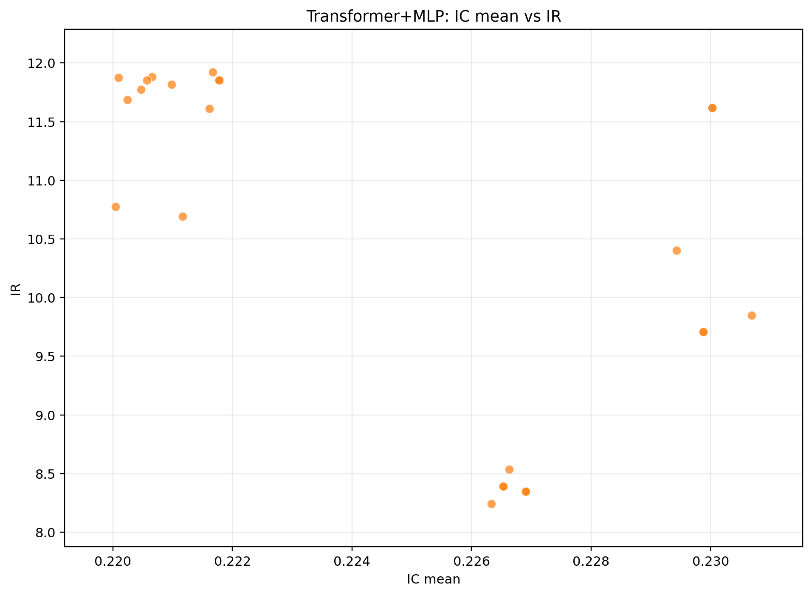
  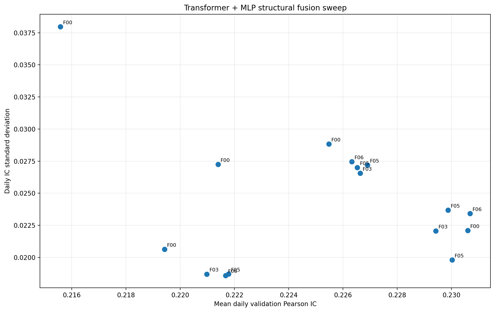
</p>

<p align="center">
  <em><b>Figure 33.</b> Validation IC mean versus IR and IC standard deviation across Transformer+MLP structural and multi-seed experiments.</em>
</p>

The results above show two main groups. The original structural experiments are concentrated near a validation IC of $0.220$–$0.222$, while several additional-seed runs reach approximately $0.226$–$0.231$. The variation in IR across seeds indicates that stochastic training conditions affect date-level stability, which motivates using paired same-seed Transformer baselines rather than comparing each fusion run with one historical Transformer result.

Within the initial controlled structural sweep, F05 achieved

$$
IC_{\mathrm{mean}}=0.22178,
\qquad
IC_{\mathrm{std}}=0.01871,
\qquad
IR=11.85,
$$

representing an IC improvement of

$$
\Delta IC=+0.00236
$$

over the same-seed F00 Transformer baseline. F06 achieved a similar result, with a slightly higher IR but a gate that was more active on average and closer to saturation. F05 was therefore preferred under the predefined near-tie rule because it used the smaller 32-unit gate and retained a more variable, interpretable gating pattern.

### Five-Seed Confirmation

After the three-seed architecture-selection stage froze F05, two additional seeds were added to extend the robustness assessment. Across the complete five-seed experiment, F05 achieved

$$
\overline{IC}_{\mathrm{F05}}
=
0.22703,
$$

compared with

$$
\overline{IC}_{\mathrm{F00}}
=
0.22250.
$$

The mean paired improvement was therefore

$$
\overline{\Delta IC}
=
0.00453.
$$

F05 improved on its same-seed F00 baseline in four of the five seeds. The one negative result was small, with an IC difference of approximately -0.00058, indicating that the fusion improvement is robust on average but not guaranteed under every random realization.

The fusion model also improved several stability measures:

- average daily IC standard deviation decreased from 0.02736 for F00 to 0.02327 for F05;
- average IR increased from 8.54 to 9.98;
- average worst-date IC improved by approximately 0.00879;
- F05 outperformed F00 on approximately $69.3\%$ of the aligned validation dates on average;
- the across-seed standard deviation of mean IC decreased from 0.00577 to 0.00335.

These results suggest that the MLP correction does not merely increase mean validation IC through a small number of unusually strong dates. On average, it also reduces daily IC variability and improves weaker-date behavior.

<p align="center">
  
  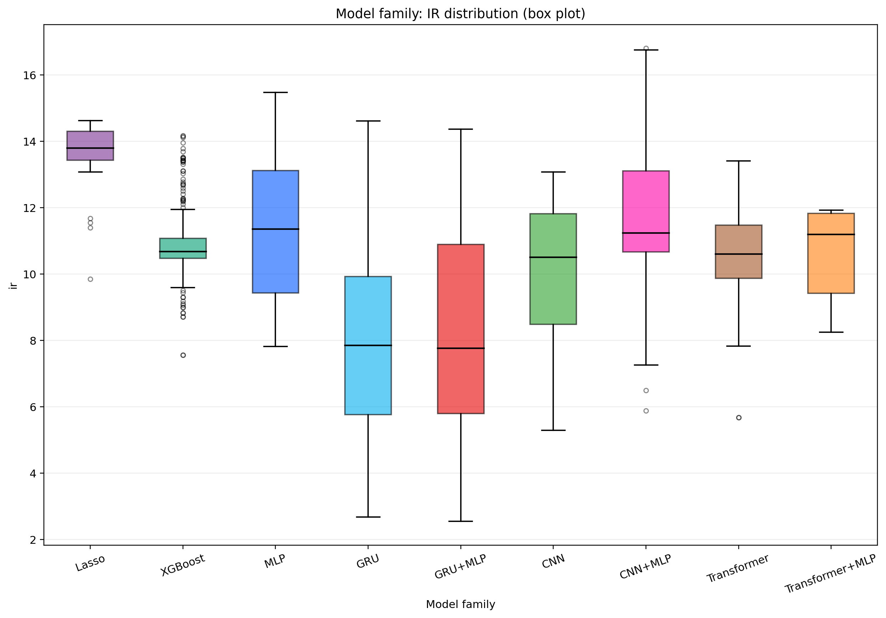
</p>

<p align="center">
  <em><b>Figure 34.</b> Distribution of validation IC mean and IR across model families (search breadth differed across model families).</em>
</p>

The cross-family comparison shows that Transformer+MLP has the highest IC distribution among the tested model families. Its advantage is most visible in predictive strength rather than in universally maximizing IR: several simpler model families contain highly stable configurations with lower mean IC. This is consistent with the project’s model-selection principle, in which IC is treated as the primary measure of predictive strength and IR is used to distinguish configurations with similar IC.

<p align="center">
  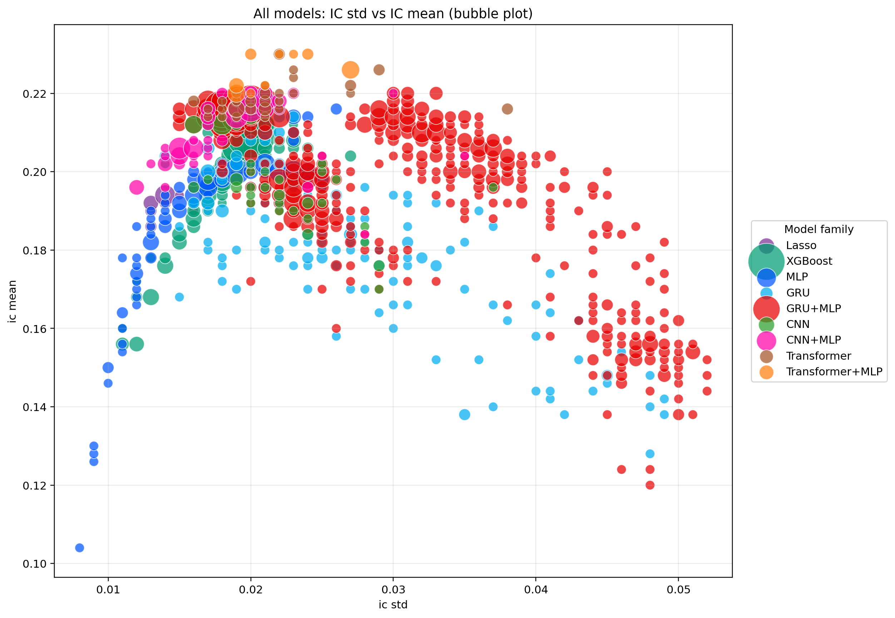
</p>

<p align="center">
  <em><b>Figure 35.</b> Validation IC standard deviation versus mean IC across all model configurations; bubble size reflects overlapping configurations within nearby regions.</em>
</p>

In the overall IC mean–IC standard-deviation comparison, Transformer+MLP occupies the upper region of the performance frontier. The selected runs combine higher mean IC with moderate daily variability, rather than obtaining higher IC through an unrestricted or highly unstable prediction head. This supports the use of the Transformer-anchored residual design as the final architecture.

### Selected Transformer+MLP Configuration

Final architecture: **Transformer-anchored gated residual**

<p align="center">
  <em><b>Table 25.</b> Selected final Transformer+MLP configuration.</em>
</p>

| Parameter | Selected Value | Parameter | Selected Value |
| :--- | :---: | :--- | :---: |
| Transformer sequence length | 8 | Transformer $d_{\mathrm{model}}$ | 80 |
| Attention heads | 4 | Transformer encoder layers | 2 |
| Feed-forward dimension | 160 | Transformer pooling | Last token |
| Transformer prediction head | 64 | Transformer dropout | 0.10 |
| MLP hidden layers | $(64,32)$ | MLP activation | ReLU |
| Common projection dimension | 64 | Residual-head hidden size | 32 |
| Residual source | MLP representation | Gate type | Scalar sigmoid |
| Gate hidden size | 32 | Gate temperature | 1.0 |
| Residual-scale mode | Learned and bounded | Initial $\alpha$ / maximum $\alpha_{\max}$ | $0.05/0.25$ |
| Initial gate bias | $-2.0$ | Transformer freeze period | First fusion epoch |
| Transformer learning rate | $2\times10^{-4}$ | MLP learning rate | $3\times10^{-4}$ |
| Fusion learning rate | $2\times10^{-4}$ | Batch size | 4,096 |
| Transformer weight decay | $1\times10^{-2}$ | MLP weight decay | $1\times10^{-3}$ |
| Fusion weight decay | $3\times10^{-4}$ | IC-loss weight | 0.15 |
| Development split | 45 train / 15 validation dates | Multi-seed confirmation | Five random seeds |
| Five-seed mean validation IC | **0.22703** | Mean paired IC uplift | **+0.00453** |
| Five-seed mean IC standard deviation | **0.02327** | Five-seed mean IR | **9.98** |
| Positive paired-uplift seeds | **4 / 5** | Mean learned residual scale | 0.05357 |
| Representative checkpoint | Median-proximity validation run | Representative selected epoch | 1 |

The representative checkpoint is selected from the run whose validation IC is closest to the median of the five gated-residual runs, rather than the run with the highest observed validation IC. This avoids selecting an unusually favorable random realization as the final model.

Overall, the experiments support three conclusions:

1. The Transformer should remain the primary temporal prediction anchor, while other branches provide additional corrections rather than replacing its prediction;
   
2. The current-state MLP contains useful incremental information when used as a residual correction branch with a bounded global scale;

3. A moderate sample-dependent gate improves residual correction by adapting the MLP contribution across observations, without requiring a high-capacity fusion head.

The selected gated-residual architecture, representative checkpoint, and evaluation protocol were frozen before the independent test period was accessed.

## Frozen Final Test Evaluation

The final model was evaluated once on the independent test period (20 days) after the architecture, selected epoch, and representative checkpoint had been frozen.

The frozen evaluation configuration was:

<p align="center">
  <em><b>Table 26.</b> Frozen final-test evaluation settings.</em>
</p>

| Setting | Frozen Value |
| :--- | :---: |
| Final architecture | Transformer-anchored gated residual |
| Selected checkpoint epoch | 1 |
| Sequence length | 8 |
| Test-time training | Disabled |
| Test-based model selection | Disabled |

The final test stage only loads the frozen checkpoint and performs inference over the 20 test dates. No additional training, epoch selection, architecture selection, or hyperparameter adjustment is conducted using the test data.

<p align="center">
  
</p>

<p align="center">
  <em><b>Figure 36.</b> Daily Pearson IC of the frozen final Transformer+MLP model across the 20-date independent test period.</em>
</p>

### Final Test Results

#### Daily Level Metrics:
<p align="center">
  <em><b>Table 27.</b> Daily-level metrics on the independent test period.</em>
</p>

| Test Metric | Result |
| :--- | ---: |
| Test dates evaluated | 20 |
| Mean daily Pearson IC | **0.22584** |
| Daily IC standard deviation | **0.02011** |
| Test IR | **11.23** |
| Median daily IC | 0.22576 |
| Worst date IC | 0.18505 |
| Best date IC | 0.26491 |
| Positive daily-IC rate | 100.0% |

#### Sample Level Metrics:
<p align="center">
  <em><b>Table 28.</b> Fusion-behavior metrics on the independent test period.</em>
</p>

| Fusion Metric | Result |
| :--- | ---: |
| Mean sample gate | 0.68861 |
| Gate standard deviation | 0.10926 |
| Learned residual scale $\alpha$ | 0.05410 |
| Low-gate collapse rate | 0.0% |
| High-gate collapse rate | 0.0% |


### Validation-to-Test Generalization

>
>The validation results are averaged across five random seeds as mentioned in the [previous section](#five-seed-confirmation); test results are reported from the final model evaluated on 20 unseen test dates.

Across the validation experiments, the mean IC of the selected F05 architecture was

$$
\overline{IC}_{\mathrm{validation}}
=
0.22703,
$$

while the frozen representative checkpoint achieves

$$
IC_{\mathrm{test}}
=
0.22584.
$$

The difference is therefore

$$
IC_{\mathrm{test}}
-
\overline{IC}_{\mathrm{validation}}
=
0.22584-0.22703
\approx
-0.00119.
$$

The frozen test IC is numerically close to the five-seed validation average, suggesting that the predictive performance observed during validation largely transfers to the previously unseen test period. This comparison is descriptive because the validation value is averaged across five runs, whereas the test result comes from one frozen representative checkpoint.

The test result also shows that the final model retains a relatively high IR.

<p align="center">
  <em><b>Table 29.</b> Five-seed validation and final-test comparison.</em>
</p>

| Metric | Five-Seed Validation | Test |
| :--- | ---: | ---: |
| Mean daily IC | 0.22703 | **0.22584** |
| Daily IC standard deviation | 0.02327 | **0.02011** |
| IR | 9.98 | **11.23** |

The median test IC,

$$
0.22576,
$$

is almost identical to the mean test IC,

$$
0.22584.
$$

This suggests that the final result is not driven by only a small number of unusually strong test dates.

All 20 test dates produce positive IC. Even the weakest date achieves

$$
IC_{\mathrm{worst}}
=
0.18505,
$$

while the strongest date reaches

$$
IC_{\mathrm{best}}
=
0.26491.
$$

<p align="center">
  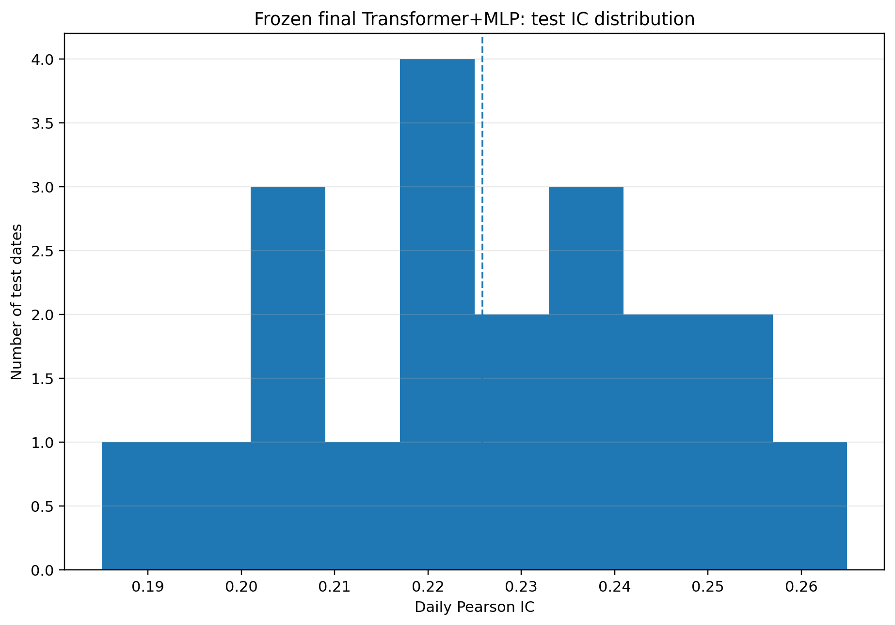
</p>

<p align="center">
  <em><b>Figure 37.</b> Distribution of daily Pearson IC across the frozen test period; the dashed line indicates the mean daily IC.</em>
</p>

### Test-Time Contribution of the MLP Residual

The final prediction retains the Transformer score explicitly:

$$
\hat{y}_{i,t}
=
s^{(T)}_{i,t}
+
\alpha g_{i,t}\Delta_{i,t}.
$$

This allows the Transformer base prediction inside the frozen fusion model to be evaluated separately from the final fused prediction.

Across the 20 test dates, the internal Transformer prediction achieves average

$$
IC_{\mathrm{internal\ Transformer}}
=
0.21971,
$$

while the complete Transformer+MLP prediction achieves average

$$
IC_{\mathrm{final}}
=
0.22584.
$$

The mean internal uplift is therefore

$$
\Delta IC_{\mathrm{internal}}
=
0.22584-0.21971
=
0.00613.
$$

The complete gated-residual prediction outperforms the internal Transformer prediction on

$$
80\%
$$

of the test dates.

This provides evidence that the current-state MLP branch continues to supply useful incremental information outside the validation period.

However, this comparison is treated as an internal diagnostic rather than an independent model comparison. The internal Transformer prediction and the complete fusion prediction come from the same trained checkpoint and share the same Transformer parameters. The evidence supporting F05 comes from the structural sweep, which compares alternative fusion designs including F00 and F05, together with the multi-seed experiments demonstrating robustness across random initializations.

### Test-Time Gate Behavior

<p align="center">
  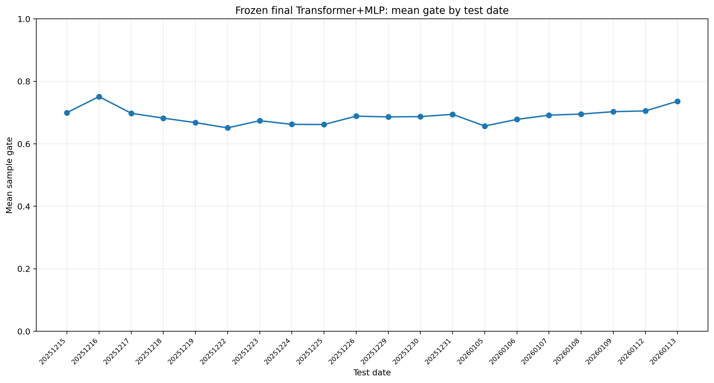
</p>

<p align="center">
  <em><b>Figure 38.</b> Mean sample-dependent gate value for each test date.</em>
</p>

The mean sample gate across the test period is

$$
\overline{g}
=
0.68861.
$$

At the date-average level, the gate remains approximately between $0.65$ and $0.75$. This indicates that the model generally uses the MLP residual correction, but does not apply it at its maximum possible strength.

No test date exhibits substantial gate collapse toward either extreme (0 or 1):

$$
g_{i,t}\approx0
\qquad\text{(low-gate collapse: residual correction suppressed)}
$$

would generally suppress the MLP correction, while

$$
g_{i,t}\approx1
\qquad\text{(high-gate collapse: residual correction almost always active)}
$$

would make the residual correction active for almost every sample.

Both the low-gate collapse rate and the high-gate collapse rate are $0\%$ across the test period.

The learned residual scale remains small:

$$
\alpha
\approx
0.05410.
$$

This is close to its initialized value. The MLP branch therefore acts as a controlled correction rather than replacing or freely adjusting the Transformer prediction.

## Final Model Conclusion

The final test results support the central architectural conclusion of the project:

>
> A stable Transformer can serve as the primary temporal prediction anchor, while an MLP that learns from the current state can provide additional information through a sample-dependent residual correction with a bounded global scale.

The final Transformer+MLP model achieves

$$
\boxed{
\text{Mean Test Pearson IC}
=
0.22584
}
$$

and

$$
\boxed{
\text{Test IR}
=
11.23.
}
$$

Its mean test IC remains close to the preceding five-seed validation result, with positive daily IC on all 20 test dates. The MLP residual improves the internal Transformer prediction on most test dates, while the independent test period remains a one-time out-of-sample evaluation.

# Conclusion and Future Work

## Project Conclusion

This project evaluates linear, tree-based, neural, and hybrid models for high-frequency return prediction.

The linear experiments first establish that the internal input representation contains a measurable predictive signal. Ridge provides a stable linear baseline, while LASSO supplies a regularized internal representation for the subsequent nonlinear models.

XGBoost and MLP show that nonlinear transformations and feature interactions provide information beyond the linear baselines. However, their results also demonstrate that a higher mean IC does not necessarily imply a higher IR.

GRU, CNN, and Transformer are then introduced to model recent temporal information explicitly. Among the evaluated temporal models, the Transformer provides the strongest balance between predictive strength and daily stability and is therefore kept as the primary temporal anchor.

The GRU+MLP and CNN+MLP experiments further show that temporal and current-state representations can be complementary. However, unrestricted concatenation does not consistently produce stable improvement. Simply increasing the capacity of the fusion head may allow the correction branch to disturb information already captured by the temporal model.

The final architecture therefore preserves the Transformer prediction and uses MLP to contribute only through a sample-dependent residual with a bounded global scale:

$$
\hat{y}_{i,t}
=
s^{(T)}_{i,t}
+
\alpha g_{i,t}\Delta_{i,t},
$$

where $s^{(T)}_{i,t}$ is the Transformer prediction, $\Delta_{i,t}$ is the correction produced by the MLP branch, $g_{i,t}\in(0,1)$ is a learned sample-dependent gate, and $\alpha$ controls the learned global residual strength within the bound $\alpha_{\max}$.

The structural ablations indicate that the main benefit does not come from adding a larger prediction head alone. The improvement is associated with three design choices:

1. retaining the Transformer as an explicit prediction anchor;
2. restricting the MLP to an incremental residual role;
3. learning when the residual should be applied through a moderate gate.

A more complex gate with higher capacity occasionally reaches a stronger individual validation result, but it also shows a greater tendency toward gate saturation. The gated-residual model with a smaller capacity is selected since it is relatively stable and easier to interpret.

Multi-seed evaluation shows that the selected architecture generally improves the Transformer baseline while reducing sensitivity to a single random initialization. The representative checkpoint is selected from a typical validation run rather than from the maximum observed result.

Finally, the architecture and evaluation protocol are frozen before the held-out period is accessed. Held-out performance remains close to the multi-seed validation result, with no material increase in date-level variability. This supports the conclusion that an MLP residual with a bounded global scale can add current-state information without replacing the more stable temporal prediction.

The main conclusion of the project is:

> Temporal and current-state information are most effectively combined when the temporal model remains the prediction anchor and the current-state model is used as a controlled, sample-dependent correction.

## Limitations

The experiments are conducted on one proprietary study setting and a relatively short temporal window. The conclusions therefore demonstrate the behavior of the evaluated architectures under this experimental design, but should not be interpreted as universal evidence that the selected structure will dominate across all instruments, market regimes, or prediction horizons.

The feature-selection and model-search stages also use finite computational budgets. Some model families receive more targeted tuning than others, so differences in the breadth of the search space should be considered when interpreting cross-family comparisons.

The held-out period is used only once, which preserves its role as an independent evaluation set. However, a single held-out period cannot fully measure robustness to long-term regime changes.

## Future Work

Future research can extend the project in several directions.

First, the architecture can be evaluated through repeated walk-forward experiments across multiple non-overlapping periods. This would provide a stronger measure of robustness under changing market regimes while preserving chronological separation between training and evaluation.

Second, the gated-residual mechanism can be studied under additional constraints. Possible extensions include regularizing gate variability, testing vector-valued gates, and measuring whether gate behavior changes systematically across volatility or liquidity regimes.

Third, model evaluation can be extended beyond predictive correlation. Portfolio-level analysis could incorporate turnover, transaction costs, signal decay, capacity, and risk-adjusted performance. This would connect the modeling results more directly with the later stages of a quantitative investment pipeline.

Fourth, the training objective could be expanded to study the interaction between pointwise regression loss, correlation-based objectives, ranking losses, and economically motivated constraints. Such experiments should continue to use validation-only model selection to avoid adapting the model to the held-out evaluation period.

## Data and Code Availability

The underlying dataset and source code are proprietary and are not included in this repository. Only study dates, generic mathematical formulations, model-architecture descriptions, evaluation methodology, and anonymized aggregate IC/IR results are reported.
