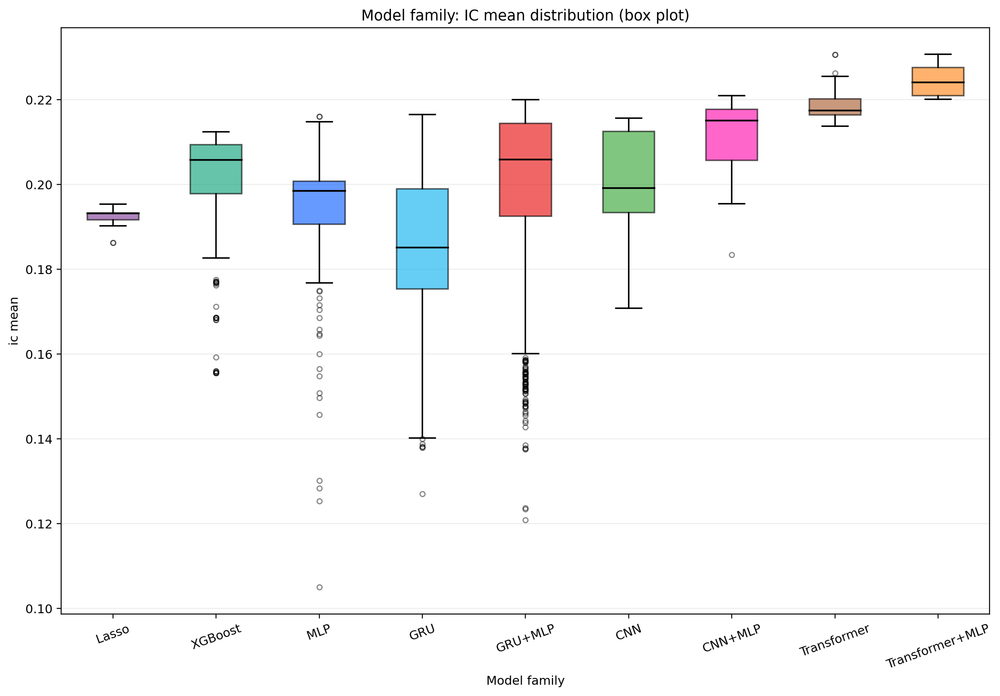
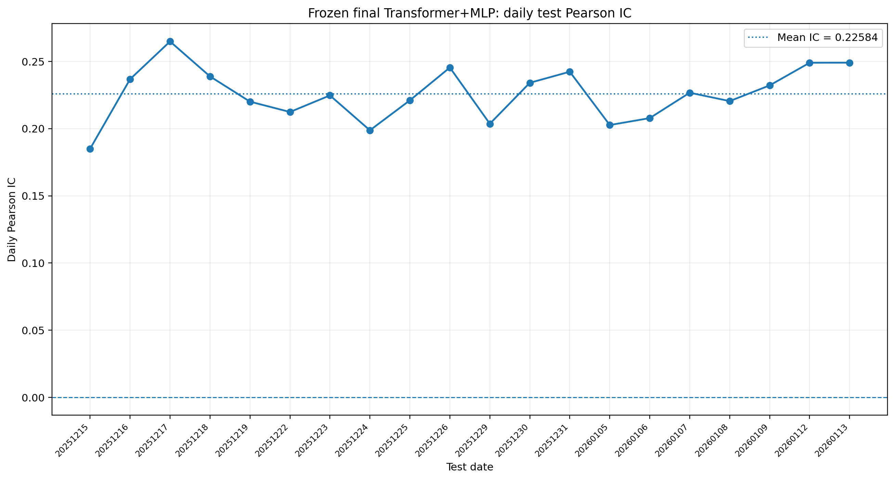

# High-Frequency Return Prediction with Machine Learning

## Overview

I built an end-to-end machine-learning pipeline for high-frequency return prediction on anonymized A-share market data. In this project, I improved predictive strength (measured by Pearson information coefficient, IC) through combining **recent temporal information** with the **current market state** while preserving prediction stability (measured by information ratio, IR).

The final model uses a **Transformer as the temporal prediction anchor** and an **MLP as a gated residual correction** (Transformer+MLP). On a 20-day test set, it achieved **0.22584 mean daily Pearson IC**, **11.23 IR**, and positive IC on **20/20 days**.

## From Baselines to the Final Model

Models were selected using validation IC for predictive strength and IR for daily stability. When candidate models produced IC values within 0.003 of the best result, I chose the model with the higher IR.

| Modeling stage | Representative result | What it established |
| --- | --- | --- |
| Ridge | IC 0.1928 / IR 11.25 | A stable linear signal exists |
| XGBoost | IC 0.2118 / IR 10.63 | Nonlinear effects and feature interactions add substantial signal |
| MLP | IC 0.2160 / IR 8.46 | Current-state nonlinear signal is strong but less stable |
| GRU / CNN | GRU: IC 0.2165 / IR 9.83; CNN: IC 0.2157 / IR 10.63 | Explicit short-term temporal modeling adds value |
| **Transformer** | IC 0.2188 / IR 13.41 | The strongest standalone temporal model, balancing predictive strength and stability |
| GRU+MLP / CNN+MLP | GRU+MLP: IC 0.2188 / IR 10.94; CNN+MLP: IC 0.2196 / IR 11.98 | Temporal and current-state representations are complementary |

  

<em>Validation IC distributions across model families (search breadth differed across model families). Transformer+MLP occupies the strongest overall IC region.</em>

The comparison led to two structural choices:

1. **Use Transformer as the anchor.** A configuration using last-token pooling provided the strongest IC–IR balance, while larger models and longer training often increased peak IC at the cost of IR.
2. **Use MLP as the complementary branch.** Its daily-IC correlation with the selected Transformer anchor was only **0.625**, the lowest among all selected neural-model candidates. About **61%** of its date-level variation was not linearly explained by the Transformer anchor.

## Final Architecture: Transformer-Anchored Gated Residual

The Transformer anchor processes an 8-step sequence using a compact configuration: an 80-dimensional representation for each time step ($d_{\text{model}}=80$), 4 attention heads, 2 encoder layers, and last-token pooling. The MLP processes only the current position through hidden layers $(64,32)$.

Instead of replacing the Transformer output with a flexible concatenation head, the MLP is restricted to providing a bounded correction:

$$
\boxed{\hat{y}_{i,t}=s^{(T)}_{i,t}+\alpha g_{i,t}\Delta_{i,t}}
$$

- $s^{(T)}$: stable base prediction from the Transformer
- $\Delta$: current-state correction provided by the MLP
- $g\in(0,1)$: sample-dependent scalar gate using both branch representations
- $\alpha$: learned global residual scale, bounded by $\alpha_{\max}=0.25$

Both branches are projected into a shared 64-dimensional space. A gate network with a 32-unit hidden layer decides how much correction to apply to each sample. The residual scale starts near 0.05, keeping the initial model close to the pretrained Transformer. During the first fusion epoch, the Transformer is frozen so that the new gate and residual layers learn to use the existing representations before limited end-to-end tuning.

## Structure Sweep: Why This Design Was Selected

I kept the internal Transformer and MLP architectures fixed and varied only the fusion mechanism in a controlled ablation study. The table below summarizes the representative experiments:

| ID | Fusion structure | Validation IC | IR | Interpretation |
| --- | --- | ---: | ---: | --- |
| F00 | Transformer only | 0.21942 | 10.64 | Controlled anchor baseline |
| F02 | Unrestricted concatenation | 0.22117 | 10.69 | Higher IC, but the stable base prediction is no longer protected |
| F03 | Bounded residual, no gate | 0.22099 | 11.82 | Confirms the value of anchored correction |
| **F05** | **Gated residual, 32-unit gate** | **0.22178** | 11.85 | Best IC with a moderate, non-collapsed gate |
| F06 | Gated residual, 64-unit gate | 0.22167 | **11.92** | Near-tie, but its higher-capacity gate was more active on average and closer to saturation |

The sweep showed that the improvement did not come from simply adding a larger prediction head. Instead, it came from:

1. preserving the Transformer as a stable temporal anchor;
2. restricting the MLP to a small bounded current-state correction; and
3. using a sample-dependent gate to control the correction for each observation.

F05 was selected over the near-tie candidate F06 because its smaller gate was more conservative and interpretable.

## Robustness and Frozen Test Result

To test whether the improvement was robust to random initialization and training order, I retrained F05 and its Transformer baseline under identical settings using five different random seeds and compared them seed by seed. F05 improved on its same-seed baseline in **4/5 runs**, achieving mean validation IC **0.22703**, mean paired uplift **+0.00453**, and mean IR **9.98**. A representative checkpoint with validation IC near the five-run median was frozen before testing.

  

<em>Daily Pearson IC of the frozen final model: mean IC 0.22584, IR 11.23, and positive IC on every test date.</em>

On the independent test set, the final model improved the internal Transformer IC from **0.21971 to 0.22584** and outperformed it on **80% of dates**. The learned residual scale remained small (**$\alpha = 0.0541$**) and the sample-dependent gate did not collapse, confirming that the MLP acted as a controlled correction without replacing the temporal model.

> [!IMPORTANT]
> The results show that temporal and current-state signals were combined most effectively when the temporal model remained the prediction anchor and the current-state model supplied a controlled, sample-dependent correction.

*The underlying data, feature definitions, security identities, source code, and internal interfaces are proprietary and are not disclosed; only anonymized aggregate results and generic model descriptions are reported.*

*A detailed report is presented [here](Full_Report.pdf).*
